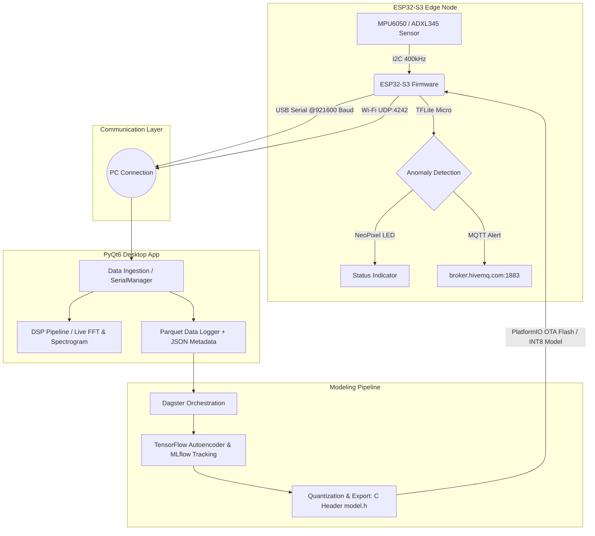
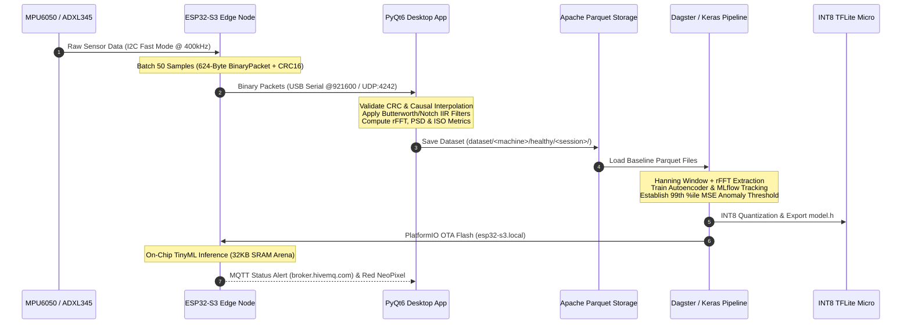

# MECHAVYBE: End-to-End Machine Vibration Sensing and Anomaly Detection

<p align="center">
  
</p>

## 1. Project Overview

MechaVybe is an end-to-end machine vibration sensing and anomaly detection system built around the ESP32-S3 microcontroller, the MPU6050 MEMS accelerometer/gyroscope, a PyQt6 desktop application, and a TensorFlow Lite autoencoder ML model. 
It is designed for industrial engineers, maintenance technicians, and researchers focused on predictive maintenance and condition monitoring of rotating machinery. The system addresses the need for a low-cost, scalable, and fully integrated solution to monitor machine health, detect anomalies in real-time on edge devices, and build customized ML models from locally acquired vibration data.

> 📚 **Deep Dive:** For a comprehensive look at the software capabilities, hardware features, and detailed industrial use cases (like bearing faults, resonance, and QA testing), please read the [Features, Use Cases, and Philosophy (FEATURES_AND_USECASES.md)](FEATURES_AND_USECASES.md) document.

### System Architecture



### Data Flow



## 2. Repository Structure

```text
MechaVybe/
├── firmware/                  # PlatformIO/Arduino C++ firmware for ESP32-S3
│   ├── include/
│   │   ├── config.h           # System pins, timing, baud rate, and network defaults
│   │   ├── imu_manager.h      # MPU6050 & ADXL345 sensor driver interface
│   │   ├── led_manager.h      # NeoPixel WS2812 status pattern manager
│   │   ├── logger.h           # Tiered variadic serial logging system
│   │   ├── nvs_manager.h      # ESP-IDF Non-Volatile Storage key-value manager
│   │   └── ota_manager.h      # ArduinoOTA over Wi-Fi update interface
│   ├── src/
│   │   ├── main.cpp           # Main loop, packet serialization, CLI, and TinyML inference
│   │   ├── imu_manager.cpp    # I2C sensor initialization, calibration, and reading
│   │   ├── led_manager.cpp    # Non-blocking LED state machine implementation
│   │   ├── logger.cpp         # Formatted logging implementation
│   │   ├── model.h            # Compiled INT8 TinyML model array & threshold
│   │   ├── nvs_manager.cpp    # Flash persistence for calibration & network configs
│   │   └── ota_manager.cpp    # Wireless OTA callback handlers
│   └── platformio.ini         # PlatformIO build environments (USB and OTA)
├── pc_app/                    # Python/PyQt6 desktop application
│   ├── main.py                # Application entry point
│   ├── core/
│   │   ├── data_logger.py     # Columnar Apache Parquet file writer + JSON metadata
│   │   ├── fft_manager.py     # Circular buffering, rFFT, Welch PSD, spectral metrics
│   │   ├── filter_manager.py  # SciPy Butterworth & Notch IIR filter pipeline
│   │   ├── plot_manager.py    # Zero-copy deque buffers for high-speed PyQtGraph plotting
│   │   └── serial_manager.py  # Dual-mode USB Serial & UDP packet parser and CRC validator
│   ├── gui/
│   │   ├── assets/            # UI icons and logo
│   │   └── main_window.py     # Multi-tab PyQt6 UI (Dashboard, FFT, DSP, Spectrogram, MQTT)
│   ├── metadata_profiles/     # Dynamic JSON metadata profiles for dataset tagging
│   │   ├── default.json       # Standard industrial profile
│   │   └── sewing.json        # Sewing machine monitoring profile
│   └── pyproject.toml         # Desktop dependencies managed via uv
└── modeling/                  # Python/TensorFlow MLOps training pipeline
    ├── src/
    │   ├── dagster_pipeline.py# Dagster software-defined assets and MLflow experiment logging
    │   ├── data.py            # Baseline Parquet ingestion and synthetic generator fallback
    │   ├── export.py          # INT8 post-training quantization & C-header generation
    │   ├── features.py        # Spectral feature extraction (Hanning window + rFFT)
    │   └── model.py           # Keras Autoencoder architecture definition
    ├── model/                 # Exported TFLite models and C headers
    │   ├── anomaly_model.tflite
    │   └── model.h
    ├── workspace.yaml         # Dagster workspace definition
    ├── dagster.yaml           # Dagster instance configuration
    └── pyproject.toml         # Modeling dependencies managed via uv
```

## 3. In-Depth Technical Dossier

### 3.1 Executive Summary & Architectural Boundaries
* **Core Functionality:** MechaVybe executes continuous condition monitoring of rotating machinery through edge-level high-frequency vibration acquisition, host-level digital signal processing, unsupervised autoencoder machine learning, and closed-loop edge deployment.
* **Architecture Pattern:** Distributed Layered & Event-Driven Embedded-to-Host Pipeline.
* **Component Breakdown & Inter-Module Communication:**
  * **Firmware:** ESP32-S3 running FreeRTOS/Arduino C++ managing deterministic I2C sensor reads, packed binary packet framing, and on-chip TinyML inference.
  * **Transport Layer:** USB Serial at 921,600 baud and Wi-Fi UDP (port 4242) for high-bandwidth raw streaming; JSON/ASCII serial commands for device configuration.
  * **Desktop Client:** PyQt6 application with asynchronous Qt timer event loops running zero-copy rolling deque plotting, SciPy IIR digital filtering, live rFFT / Welch PSD calculation, and PyArrow Parquet file logging.
  * **MLOps Pipeline:** Dagster orchestration pipeline reading partitioned Parquet datasets, extracting spectral features, training a TensorFlow Autoencoder tracked in MLflow (`sqlite:///mlruns.db`), generating INT8 TFLite C headers, and triggering wireless OTA firmware uploads via PlatformIO subprocess execution.
  * **Alerting:** MQTT pub/sub over TCP (port 1883) to `broker.hivemq.com` for remote anomaly notifications.

### 3.2 Deep-Dive Tech Stack & Dependencies
* **Core Languages & Runtimes:**
  * **C++14 (`gnu++14`):** Target: ESP32-S3 Xtensa dual-core 32-bit LX7 @ 240 MHz. Build flags: `-std=gnu++14`, `-fno-access-control`, `-DBOARD_HAS_PSRAM`, `-DTF_LITE_STATIC_MEMORY`.
  * **Python 3.13+:** Runtimes for desktop and modeling modules, managed with the `uv` packaging engine.
* **Frameworks & Core Libraries:**
  * **Firmware:** `esp-tflite-micro`, `Adafruit_MPU6050` (v2.2.6), `Adafruit_Sensor` (v1.1.14), `Adafruit_ADXL345_U` (v1.3.4), `Adafruit_NeoPixel` (v1.12.0), `PubSubClient` (v2.8), `ArduinoOTA`, ESP-IDF `Preferences` (NVS), `Wire` (Fast Mode 400 kHz).
  * **Desktop App:** `PyQt6` (v6.11.0), `pyqtgraph` (v0.14.0), `pyserial` (v3.5), `scipy` (v1.18.1), `pandas` (v3.0.5), `pyarrow` (v25.0.1), `paho-mqtt` (v2.1.0), `Pillow` (v12.3.0).
  * **Modeling & Orchestration:** `dagster` & `dagster-webserver` (v1.13.19), `tensorflow` (v2.21.0), `mlflow` (v2.0+), `scikit-learn` (v1.9.0), `numpy` (v2.5.2).
* **External Integrations:** HiveMQ Public MQTT Broker (`broker.hivemq.com:1883`), MLflow Tracking Server (`sqlite:///mlruns.db`), ArduinoOTA daemon (`esp32-s3.local`), PlatformIO CLI subprocess runner.

### 3.3 Object-Oriented Programming (OOP) & Design Patterns
* **OOP Principles in Practice:**
  * **Encapsulation:**
    * `NvsManager`: Encapsulates ESP-IDF `Preferences` storage under the `esp32s3_app` namespace, exposing strictly typed getters/setters for calibration, sample rates, and network credentials.
    * `FftManager`: Encapsulates circular buffers (`buffer_x`, `buffer_y`, `buffer_z`) and pointer tracking (`ptr`, `is_full`), protecting internal buffer indexing from external components.
    * `SerialManager`: Encapsulates raw serial byte buffering, CRC verification, and UDP socket states.
  * **Inheritance & Polymorphism:**
    * `ImuApp` inherits from `PyQt6.QtWidgets.QMainWindow`, overriding lifecycle events and slot handlers.
    * Sensor polymorphism in `ImuManager`: Unifies `Adafruit_MPU6050` and `Adafruit_ADXL345_Unified` behind common interfaces (`begin()`, `setRanges()`, `calibrate()`, `handle()`) leveraging `Adafruit_Sensor`'s `sensors_event_t`.
  * **Abstraction:**
    * Mathematical isolation in `FilterManager`: Decouples Butterworth, Notch, and detrending filters from UI rendering and data acquisition.
    * Dagster Software-Defined Assets (SDA): Abstracts data ingestion, feature transformation, training, quantization, and deployment into declarative asset functions.
* **Design Patterns Used:**
  * **State Pattern:** `LedManager` implements a non-blocking state machine over `LedPattern` (`OFF`, `SOLID`, `SLOW_PULSE`, `FAST_FLASH`, `DOUBLE_BLINK`, `RAPID_STROBE`).
  * **Observer / Signal-Slot Pattern:** `ImuApp` uses `pyqtSignal(str, float)` (`mqtt_msg_signal`) to safely communicate between the background `paho-mqtt` network thread and the main Qt GUI thread.
  * **Strategy Pattern:** Selectable windowing strategies (Hanning, Hamming, Blackman, Rectangular) in `FftManager` and selectable filter types (Low-pass, High-pass, Band-pass, Band-stop) in `FilterManager`.
  * **Facade Pattern:** `SerialManager` provides a unified interface abstracting both USB UART serial communication and Wi-Fi UDP socket datagrams.
  * **Singleton / Static Utility:** `Logger` in firmware provides a static interface for tiered diagnostic logging (`DEBUG`, `INFO`, `WARN`, `ERROR`).

### 3.4 Data Layer, Security & Tenant Isolation
* **Storage Engines:**
  * **Microcontroller Flash NVS:** Key-value persistence in ESP-IDF NVS partition for hardware calibration matrices, sample rates, and network endpoints.
  * **Columnar Apache Parquet Storage:** High-frequency vibration data is stored using PyArrow Parquet format (`data.parquet`) with directory partitioning:
    `dataset/<machine_id>/<condition>/<session_id>/data.parquet` paired with a companion `metadata.json`.
  * **Experiment Registry:** SQLite database (`sqlite:///mlruns.db`) tracking model weights, loss curves, and anomaly thresholds via MLflow.
* **Security & Auth:**
  * Wi-Fi credentials stored in protected internal flash via NVS.
  * OTA updates protected via ArduinoOTA callback hooks (`OTA_AUTH_ERROR`) and hostname resolution.
  * Tenant and dataset isolation: The ML training pipeline in `data.py` explicitly isolates data from `**/healthy/**/*.parquet` directories, preventing contaminated or faulty machine data from polluting the baseline model.

### 3.5 Concurrency, Performance & Memory Management
* **Resource Optimization:**
  * **Binary Packet Packing:** C struct packed with `#pragma pack(push, 1)` bundles 50 six-axis floating point samples (300 floats) into exactly 624 bytes, eliminating 98% of serial framing overhead compared to JSON.
  * **Zero-Copy Ring Buffers:** `PlotManager` uses `collections.deque(maxlen=500)` and `FftManager` pre-allocates fixed NumPy arrays (`np.zeros(size)`) to eliminate dynamic memory allocations and Python garbage collection pauses during 1 kHz streaming.
  * **Internal SRAM Allocation:** TFLite Micro tensor arena (32 KB) is allocated strictly in internal 8-bit SRAM (`heap_caps_malloc(MALLOC_CAP_INTERNAL | MALLOC_CAP_8BIT)`), eliminating external PSRAM bus latency during inference.
  * **Static Operator Resolver:** `tflite::MicroMutableOpResolver<3>` registers only `AddFullyConnected`, `AddRelu`, and `AddLogistic`, stripping unused TFLite kernels and saving flash memory.
* **Concurrency Model:**
  * **Firmware:** FreeRTOS non-blocking cooperative execution loop with hardware interrupts (`IRAM_ATTR rpm_isr()`) for optical/Hall-effect tachometer pulse counting.
  * **Desktop Application:** Single-threaded Qt event loop driven by high-frequency multi-tier timers:
    * `10 ms` timer for draining serial buffers.
    * `100 ms` timer for FFT, PSD, and Spectrogram computations.
    * `1000 ms` timer for host-to-device ping keep-alives.
  * **MQTT Concurrency:** `paho-mqtt` background network loop (`loop_start()`) running on a separate daemon thread, synchronized with the UI via Qt signals.

### 3.6 Edge Cases, Error Handling & Technical Trade-Offs
* **Resilience & Fault Handling:**
  * **Serial Resynchronization & CRC Validation:** `SerialManager` validates incoming packets against an XOR checksum. Upon byte loss or sync word misalignment (`0xAABB`), it shifts byte-by-byte (`byte_buffer.pop(0)`) until resynchronized.
  * **Stream Continuity & Packet Drop Detection:** Sequence ID tracking identifies dropped samples versus hardware resets, computing stream integrity percentages in real time.
  * **Sensor Clone Freezing Mitigation:** MPU6050 DLPF bandwidth is capped at `184 Hz` (`MPU6050_BAND_184_HZ`) rather than disabling the filter, preventing hardware lockups observed on clone sensors. ADXL345 I2C sampling is constrained to 800 Hz to prevent I2C bus starvation.
  * **Filter Stability Protection:** `FilterManager` dynamically constrains cutoff frequencies to valid Nyquist boundaries (`0.1 < lc < hc < 0.5 * fs - 0.1`) and uses adaptive padding in `filtfilt` to prevent matrix singularity crashes on short buffers.
  * **MQTT Rate Limiting:** Anomaly notifications are throttled to a maximum of 1 alert per 10 seconds to prevent broker flooding. If MQTT drops, local inference continues uninterrupted and the LED switches to an orange pulsing pattern.
* **Technical Trade-Offs:**
  * **Binary Struct Protocol vs. JSON Telemetry:** Binary packing delivers minimal bandwidth consumption and zero serialization CPU overhead on the ESP32, but introduces cross-platform endianness and strict struct alignment dependencies (`struct.unpack('<HIIfffB...')`).
  * **Unsupervised Autoencoder vs. Supervised Classification:** Unsupervised training eliminates the requirement to collect catastrophic failure data on production machinery, but requires establishing empirical statistical thresholds (99th percentile MSE) and cannot explicitly classify multiple simultaneous failure types without downstream spectral analysis.
  * **Causal Linear Timestamp Interpolation vs. Per-Sample RTC Clocking:** Linearly interpolating sample timestamps within a 50-sample packet based on sequence deltas eliminates high-overhead microsecond clock reads per axis on the ESP32 while providing a smooth continuous signal on the desktop.
  * **Internal SRAM Arena vs. External PSRAM Arena:** Allocating the 32 KB Tensor Arena strictly in internal SRAM maximizes memory access speeds and guarantees sub-millisecond inference latency at the expense of restricting the neural network depth.

---

## 4. Key Terminology & Concepts

**Accelerometer**
- **What it is:** A device that measures proper acceleration.
- **Why it matters:** Captures the raw mechanical vibrations of a machine.
- **Sensing principle:** Micro-Electro-Mechanical Systems (MEMS) use microscopic proof masses suspended by springs. Acceleration displaces the mass, changing capacitance, which is converted to voltage.
- **Units:** Measured in $m/s^2$ or $g$ ($1g \approx 9.81 m/s^2$).
- **Tradeoff:** Higher sensitivity allows detecting subtle vibrations but limits the maximum measurable range (e.g., $\pm 2g$ vs $\pm 16g$) before clipping.

**Gyroscope**
- **What it is:** Measures angular velocity.
- **Units:** Radians per second ($rad/s$) or degrees per second ($deg/s$).
- **Drift & Bias:** MEMS gyros accumulate error over time (drift) and have a zero-rate offset (bias) that must be calibrated out.

**Sampling Rate ($f_s$)**
- **What it is:** The number of sensor readings taken per second.
- **Nyquist Theorem:** To accurately capture a frequency $f_{max}$, the sampling rate must be at least twice that frequency ($f_s \ge 2 f_{max}$).
- **Why 1kHz:** Sufficient to capture high-frequency vibration signatures of typical mechanical faults (up to 500Hz).
- **Aliasing:** High frequencies folding back into the low-frequency spectrum if $f_s$ is too low.

**DLPF (Digital Low-Pass Filter)**
- **What it is:** Hardware filter inside the MPU6050 to attenuate high frequencies.
- **Why it matters:** Acts as an anti-aliasing filter before analog-to-digital conversion.

**FFT (Fast Fourier Transform)**
- **What it is:** Algorithm computing the Discrete Fourier Transform. Converts a signal from the time domain to the frequency domain.
- **Formula:** $X[k] = \sum_{n=0}^{N-1} x[n] \cdot e^{-j2\pi kn/N}$
- **Frequency Resolution:** $\Delta f = \frac{f_s}{N}$ (where $N$ is the number of samples).
- **Interpretation:** Shows the amplitude of vibration at specific frequencies (bins). The DC component ($0$ Hz) represents the static offset (e.g., gravity).

**Windowing Functions**
- **What they are:** Mathematical functions applied to the time-domain signal before FFT.
- **Why:** Mitigates spectral leakage caused by discontinuous boundaries of finite sample blocks.
- **Types:**
  - Hanning/Hamming: Good frequency resolution, moderate amplitude accuracy.
  - Blackman: Low spectral leakage, wider main lobe.
  - Rectangular: No window applied.
- **Amplitude Correction:** Windowing reduces total signal energy; a correction factor must be applied to recover true amplitudes.

**Power Spectral Density (PSD)**
- **What it is:** Measures the signal's power content versus frequency.
- **Method:** Often computed via Welch's method (averaging overlapping windowed periodograms).
- **Units:** $(m/s^2)^2/Hz$ or $g^2/Hz$.

**RMS (Root Mean Square)**
- **What it is:** The most standard measure of overall vibration severity.
- **Formula:** $RMS = \sqrt{\frac{1}{N} \sum_{i=1}^{N} x_i^2}$
- **Usage:** Standardized by ISO 10816 for evaluating machine condition.

**Peak Amplitude & Peak-to-Peak**
- **Peak:** Maximum instantaneous absolute amplitude.
- **Peak-to-Peak (P2P):** Total excursion of the signal ($P2P = \max(x) - \min(x)$).

**Crest Factor**
- **What it is:** Ratio of Peak to RMS.
- **Formula:** $CF = \frac{\text{Peak}}{RMS}$
- **Usage:** Values $>3.5$ often indicate impulsive impacts typical of early-stage rolling element bearing defects.

**Dominant Frequency & Harmonics**
- **Dominant Frequency:** The single frequency bin with the highest amplitude.
- **Harmonics:** Integer multiples (2x, 3x, etc.) of the fundamental running speed (1x). 
- **Usage:** Misalignment typically presents as strong 2x harmonics, while mechanical looseness generates many high-order harmonics.

**Spectral Centroid**
- **What it is:** The "center of mass" of the spectrum.
- **Formula:** $f_c = \frac{\sum (f \cdot A(f))}{\sum A(f)}$
- **Usage:** Shifts in the centroid indicate a change in the frequency distribution (e.g., a shift to higher frequencies implies bearing wear).

**Band Power**
- **What it is:** Total signal energy integrated over a specific frequency band.
- **Usage:** Useful for monitoring known fault frequencies (e.g., a specific gear mesh frequency band).

**Butterworth Filter**
- **What it is:** A type of signal processing filter designed to have a maximally flat frequency response in the passband.
- **Transfer Function:** $|H(j\omega)|^2 = \frac{1}{1 + (\omega/\omega_c)^{2N}}$
- **Types:** Low-pass, high-pass, band-pass, band-stop.

**Notch Filter**
- **What it is:** A narrow band-stop filter.
- **Usage:** Removes specific interfering frequencies, such as 50Hz or 60Hz mains electrical noise.

**DC Offset Removal & Detrending**
- **DC Offset Removal:** Subtracting the mean of the signal to center it around zero. Critical before FFT to avoid a massive 0Hz spike.
- **Detrending:** Removing linear drift (slope) accumulated over the sampling window.

**Autoencoder (ML)**
- **What it is:** An unsupervised neural network trained to reconstruct its input.
- **Architecture:** `Input -> Encoder (compresses to latent space) -> Bottleneck -> Decoder (reconstructs) -> Output`
- **Why it matters:** When trained solely on "healthy" vibration spectra, the network learns normal patterns. When fed anomalous data (faults), the network fails to reconstruct it accurately.

**Reconstruction Error (MSE) & Anomaly Threshold**
- **MSE Formula:** $MSE = \frac{1}{n} \sum_{i=1}^{n} (x_i - \hat{x}_i)^2$
- **Usage:** Used as the anomaly score.
- **Threshold:** A statistical boundary (often the 99th percentile of the MSE of healthy validation data). Inputs yielding an MSE above this are flagged as anomalies.

**INT8 Quantization**
- **What it is:** Converting 32-bit floating-point ML model weights/activations to 8-bit integers.
- **Formula:** $q = \text{round}(x / \text{scale}) + \text{zero\_point}$
- **Why:** Drastically reduces memory footprint and inference latency, enabling execution on microcontrollers like the ESP32-S3.

**CRC (Cyclic Redundancy Check)**
- **What it is:** An error-detecting code used to verify data integrity over the binary protocol.

**Binary Packet Protocol**
- **What it is:** A highly efficient structured binary payload. 
- **Structure:** Header (`0xAABB`) + Sequence Number + Timestamp + Aux Data (RPM/Volts/Amps) + Sensor Sample Array + CRC16.

**NVS (Non-Volatile Storage) & OTA (Over-The-Air)**
- **NVS:** ESP32's internal flash storage for saving configuration variables across reboots.
- **OTA:** Allows pushing firmware updates to the ESP32 over Wi-Fi without requiring a physical USB connection.

---

## 5. Vibration Analysis Use Cases

- **Bearing Fault Detection:** Detection of specific bearing defects using fault frequencies:
  - BPFO (Ball Pass Frequency Outer race)
  - BPFI (Ball Pass Frequency Inner race)
  - BSF (Ball Spin Frequency)
  - FTF (Fundamental Train Frequency)
- **Rotor Imbalance:** Characterized by a strong vibration spike at exactly 1x the RPM running frequency.
- **Shaft Misalignment:** Typically shows elevated vibration at 2x RPM, sometimes accompanied by 1x and 3x peaks.
- **Mechanical Looseness:** Produces multiple harmonics (2x, 3x, 4x, etc.) and a raised noise floor.
- **Gear Mesh Faults:** High-frequency vibrations centered around the Gear Mesh Frequency ($GMF = \text{Teeth} \times \text{RPM}$).
- **Resonance Identification:** Amplified vibrations when running speed coincides with the machine's natural frequency.

---

## 6. ISO Standards Reference

The system metrics map to standard condition monitoring guidelines:

- **ISO 10816 / ISO 20816:** Standard for evaluating machine vibration by measurements on non-rotating parts. Defines severity zones (A, B, C, D) based on RMS velocity.
- **ISO 13373:** Condition monitoring and diagnostics of machines, providing general guidelines for vibration analysis procedures.

---

## 7. Device Operation & Diagnostics

### Button Controls & Mode Switching
* **Mode Switching:** Long-press the **BOOT Button (GPIO 0) for 1.5s** to toggle between **Data Collection Mode** (streaming to PC) and **Inference Mode** (running TinyML locally and publishing to MQTT).

### LED Indicator Patterns
* 🟨 **Yellow:** Connecting to Wi-Fi / Trying to Reconnect.
* 🟦 **Blue:** OTA Update in progress.
* 🩵 **Cyan:** Data Collection Mode (Active).
* 🟪 **Magenta:** Mode switching.
* 🟩 **Green:** Inference Mode (Healthy / No Anomaly).
* 🟥 **Red:** Inference Mode (Anomaly Detected).
* 🟧 **Orange (Flashing):** Inference Mode (MQTT Offline).

*In Inference Mode, the status is published via MQTT to `broker.hivemq.com` under the topic `mechavybe/status`. If MQTT is unavailable, the device will flash Orange rapidly before each prediction (which will still evaluate locally) and output `[MQTT OFFLINE]` to the Serial Diagnostic CLI.*

### ESP32 Serial Diagnostic CLI
You can connect a serial terminal (like PuTTY or PlatformIO Monitor) at 921600 baud directly to the ESP32 to interact with it via a built-in command-line interface. 

Commands:
* `help` - Show the available commands.
* `status` - Print the current mode, Wi-Fi, MQTT state, and latest prediction.
* `mode <0|1>` - Switch between Data Collection (0) and Inference (1) mode.
* `log on` - Stream inference predictions (`>>> [DIAGNOSTIC] Score:...`) to the console.
* `log off` - Stop streaming predictions.
* `wifi <ssid> <pwd>` - Set the Wi-Fi credentials.
* `mqtt <server> <port> <topic>` - Set the MQTT configuration.

---

## 8. Communication Protocol Reference

### Binary Packet Structure

| Offset (Bytes) | Field | Type | Description |
|---|---|---|---|
| 0 | Header | uint16 | Fixed sync word `0xAABB` |
| 2 | Sequence | uint32 | Monotonically increasing packet ID |
| 6 | Timestamp | uint32 | Microseconds since boot |
| 10 | RPM | float32 | Calculated RPM from tachometer ISR (-1 if disabled) |
| 14 | Voltage | float32 | Analog bus voltage reading (-1 if disabled) |
| 18 | Current | float32 | Analog load current reading (-1 if disabled) |
| 22 | Sample Count | uint8 | Number of samples in batch (fixed to 50) |
| 23 | Payload | int16 x 300 | 50 samples of 6-axis data (Accel X,Y,Z, Gyro X,Y,Z) |
| 623 | CRC16 | uint16 | XOR checksum of bytes 0-622 |

### Serial Commands

| Command | Description | Example |
|---|---|---|
| `SET:RATE:<val>` | Set sampling rate (Hz) | `SET:RATE:1000` |
| `SET:ACCEL:<val>` | Set accelerometer range ($\pm g$) | `SET:ACCEL:4` |
| `SET:GYRO:<val>` | Set gyroscope range ($\pm deg/s$) | `SET:GYRO:500` |
| `SET:SENSOR:<val>` | Set sensor model (`MPU6050` or `ADXL345`) | `SET:SENSOR:MPU6050` |
| `SET:CALIBA:<ox,oy,oz,sx,sy,sz>` | Set manual calibration offsets & scales | `SET:CALIBA:0.0,0.0,0.0,1.0,1.0,1.0` |
| `SET:MQTT:<srv,port,topic>` | Set MQTT broker configuration | `SET:MQTT:broker.hivemq.com,1883,mechavybe/status` |
| `GET:INFO` | Retrieve system configuration in JSON format | `GET:INFO` |
| `CMD:CALIBRATE` | Trigger auto zero-offset calibration routine | `CMD:CALIBRATE` |
| `PING` | Host-device heartbeat keepalive | `PING` |

---

## 9. Quick Start Guide

### Hardware Requirements
- ESP32-S3 Development Board (e.g. ESP32-S3-DevKitC-1)
- MPU6050 or ADXL345 Breakout Board (I2C)
- Jumper wires and USB-C cable

### Firmware Flashing
1. Install VS Code and the PlatformIO extension.
2. Open the `firmware/` directory in PlatformIO.
3. Build and Upload to your ESP32-S3 via USB Serial.

### PC App Installation
1. Install Python 3.13+ and the `uv` package manager.
2. Navigate to `pc_app/` and synchronize dependencies:
   ```bash
   cd pc_app
   uv sync
   ```
3. Launch the desktop application:
   ```bash
   uv run main.py
   ```

### End-to-End Workflow
1. **Connect:** Connect the ESP32 via USB or Wi-Fi (UDP).
2. **Record:** Use the PC app to log healthy baseline machine vibration data to Parquet format.
3. **Train:** Navigate to `modeling/` and execute the ML pipeline:
   ```bash
   cd modeling
   uv run dagster dev
   ```
   Track metrics and loss curves concurrently in MLflow:
   ```bash
   uv run mlflow ui
   ```
4. **Deploy:** The Dagster pipeline automatically quantizes the model to INT8, generates `model.h`, and deploys it to the ESP32 via PlatformIO OTA to enable edge anomaly detection.

---

## 10. License

[MIT License](LICENSE)

Copyright (c) 2026

Permission is hereby granted, free of charge, to any person obtaining a copy of this software and associated documentation files (the "Software"), to deal in the Software without restriction, including without limitation the rights to use, copy, modify, merge, publish, distribute, sublicense, and/or sell copies of the Software, and to permit persons to whom the Software is furnished to do so, subject to the following conditions:

The above copyright notice and this permission notice shall be included in all copies or substantial portions of the Software.

THE SOFTWARE IS PROVIDED "AS IS", WITHOUT WARRANTY OF ANY KIND, EXPRESS OR IMPLIED, INCLUDING BUT NOT LIMITED TO THE WARRANTIES OF MERCHANTABILITY, FITNESS FOR A PARTICULAR PURPOSE AND NONINFRINGEMENT.
