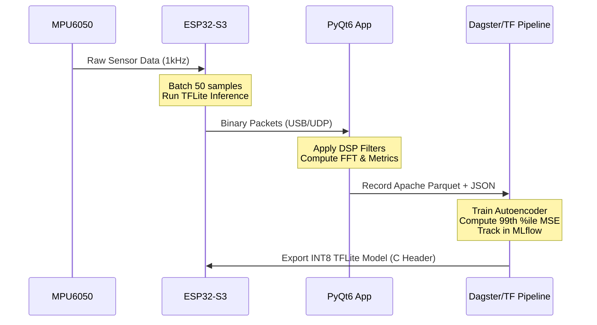

# MechaVybe: End-to-End Machine Vibration Sensing and Anomaly Detection

## 1. Project Overview

MechaVybe is an end-to-end machine vibration sensing and anomaly detection system built around the ESP32-S3 microcontroller, the MPU6050 MEMS accelerometer/gyroscope, a PyQt6 desktop application, and a TensorFlow Lite autoencoder ML model. 
It is designed for industrial engineers, maintenance technicians, and researchers focused on predictive maintenance and condition monitoring of rotating machinery. The system addresses the need for a low-cost, scalable, and fully integrated solution to monitor machine health, detect anomalies in real-time on edge devices, and build customized ML models from locally acquired vibration data.

### System Architecture

```mermaid
flowchart TD
    subgraph Hardware Edge [ESP32-S3 Edge Node]
        A[MPU6050 Accelerometer/Gyro] -->|I2C| B(ESP32-S3 Firmware)
        B -->|TFLite Micro| C{Anomaly Detection}
        C -->|NeoPixel LED| D[Status Indicator]
    end

    subgraph Connectivity [Communication Layer]
        B -->|USB Serial @921600| E((PC Connection))
        B -->|Wi-Fi UDP:4242| E
    end

    subgraph PC Application [PyQt6 Desktop App]
        E --> F[Data Ingestion]
        F --> G[DSP Pipeline / Live FFT]
        F --> H[Parquet Data Logger]
    end

    subgraph ML Pipeline [Modeling Pipeline]
        H --> I[Dagster Orchestration]
        I --> J[TensorFlow Autoencoder & MLflow Tracking]
        J --> K[Quantization & Export (C Header)]
        K -->|INT8 TFLite Model| B
    end
```

### Data Flow



## 2. Repository Structure

```text
MechaVybe/
├── firmware/                  # PlatformIO/Arduino C++ firmware for ESP32-S3
│   ├── src/
│   │   ├── main.cpp           # Main application loop
│   │   ├── sensor.cpp         # MPU6050 I2C reading logic
│   │   ├── comms.cpp          # USB Serial and Wi-Fi UDP packet framing
│   │   └── ml_model.cpp       # TFLite Micro inference and deployment
│   ├── include/
│   │   └── model_data.h       # Exported C header of the INT8 TFLite model
│   └── platformio.ini         # PlatformIO build configuration
├── pc_app/                # Python/PyQt6 desktop application
│   ├── main.py                # App entry point
│   ├── ui/                    # PyQt6 UI layout and styling
│   ├── dsp/                   # Digital Signal Processing, filtering, FFT
│   └── storage/               # Parquet writer and JSON metadata logger
└── modeling/                  # Python/TensorFlow training pipeline
    ├── src/                   # Modular training assets
    │   ├── dagster_pipeline.py# Dagster assets and MLflow integration
    │   ├── data.py            # Data ingestion
    │   ├── features.py        # Spectral feature extraction
    │   ├── model.py           # Autoencoder architecture
    │   └── export.py          # Quantization and header generation
    ├── workspace.yaml         # Dagster workspace config
    └── pyproject.toml         # Dependencies (uv)
```

## 3. Key Terminology & Concepts

**Accelerometer**
- **What it is:** A device that measures proper acceleration.
- **Why it matters:** Captures the raw mechanical vibrations of a machine.
- **Sensing principle:** Micro-Electro-Mechanical Systems (MEMS) use microscopic proof masses suspended by springs. Acceleration displaces the mass, changing capacitance, which is converted to voltage.
- **Units:** Measured in $m/s^2$ or $g$ ($1g \approx 9.81 m/s^2$).
- **Tradeoff:** Higher sensitivity allows detecting subtle vibrations but limits the maximum measurable range (e.g., $\pm 2g$ vs $\pm 16g$) before clipping.

**Gyroscope**
- **What it is:** Measures angular velocity.
- **Units:** Radians per second ($rad/s$) or degrees per second ($deg/s$).
- **Drift & Bias:** MEMS gyros accumulate error over time (drift) and have a zero-rate offset (bias) that must be calibrated out.

**Sampling Rate ($f_s$)**
- **What it is:** The number of sensor readings taken per second.
- **Nyquist Theorem:** To accurately capture a frequency $f_{max}$, the sampling rate must be at least twice that frequency ($f_s \ge 2 f_{max}$).
- **Why 1kHz:** Sufficient to capture high-frequency vibration signatures of typical mechanical faults (up to 500Hz).
- **Aliasing:** High frequencies folding back into the low-frequency spectrum if $f_s$ is too low.

**DLPF (Digital Low-Pass Filter)**
- **What it is:** Hardware filter inside the MPU6050 to attenuate high frequencies.
- **Why it matters:** Acts as an anti-aliasing filter before analog-to-digital conversion.

**FFT (Fast Fourier Transform)**
- **What it is:** Algorithm computing the Discrete Fourier Transform. Converts a signal from the time domain to the frequency domain.
- **Formula:** $X[k] = \sum_{n=0}^{N-1} x[n] \cdot e^{-j2\pi kn/N}$
- **Frequency Resolution:** $\Delta f = \frac{f_s}{N}$ (where $N$ is the number of samples).
- **Interpretation:** Shows the amplitude of vibration at specific frequencies (bins). The DC component ($0$ Hz) represents the static offset (e.g., gravity).

**Windowing Functions**
- **What they are:** Mathematical functions applied to the time-domain signal before FFT.
- **Why:** Mitigates spectral leakage caused by discontinuous boundaries of finite sample blocks.
- **Types:**
  - Hanning/Hamming: Good frequency resolution, moderate amplitude accuracy.
  - Blackman: Low spectral leakage, wider main lobe.
  - Rectangular: No window applied.
- **Amplitude Correction:** Windowing reduces total signal energy; a correction factor must be applied to recover true amplitudes.

**Power Spectral Density (PSD)**
- **What it is:** Measures the signal's power content versus frequency.
- **Method:** Often computed via Welch's method (averaging overlapping windowed periodograms).
- **Units:** $(m/s^2)^2/Hz$ or $g^2/Hz$.

**RMS (Root Mean Square)**
- **What it is:** The most standard measure of overall vibration severity.
- **Formula:** $RMS = \sqrt{\frac{1}{N} \sum_{i=1}^{N} x_i^2}$
- **Usage:** Standardized by ISO 10816 for evaluating machine condition.

**Peak Amplitude & Peak-to-Peak**
- **Peak:** Maximum instantaneous absolute amplitude.
- **Peak-to-Peak (P2P):** Total excursion of the signal ($P2P = \max(x) - \min(x)$).

**Crest Factor**
- **What it is:** Ratio of Peak to RMS.
- **Formula:** $CF = \frac{\text{Peak}}{RMS}$
- **Usage:** Values $>3.5$ often indicate impulsive impacts typical of early-stage rolling element bearing defects.

**Dominant Frequency & Harmonics**
- **Dominant Frequency:** The single frequency bin with the highest amplitude.
- **Harmonics:** Integer multiples (2x, 3x, etc.) of the fundamental running speed (1x). 
- **Usage:** Misalignment typically presents as strong 2x harmonics, while mechanical looseness generates many high-order harmonics.

**Spectral Centroid**
- **What it is:** The "center of mass" of the spectrum.
- **Formula:** $f_c = \frac{\sum (f \cdot A(f))}{\sum A(f)}$
- **Usage:** Shifts in the centroid indicate a change in the frequency distribution (e.g., a shift to higher frequencies implies bearing wear).

**Band Power**
- **What it is:** Total signal energy integrated over a specific frequency band.
- **Usage:** Useful for monitoring known fault frequencies (e.g., a specific gear mesh frequency band).

**Butterworth Filter**
- **What it is:** A type of signal processing filter designed to have a maximally flat frequency response in the passband.
- **Transfer Function:** $|H(j\omega)|^2 = \frac{1}{1 + (\omega/\omega_c)^{2N}}$
- **Types:** Low-pass, high-pass, band-pass, band-stop.

**Notch Filter**
- **What it is:** A narrow band-stop filter.
- **Usage:** Removes specific interfering frequencies, such as 50Hz or 60Hz mains electrical noise.

**DC Offset Removal & Detrending**
- **DC Offset Removal:** Subtracting the mean of the signal to center it around zero. Critical before FFT to avoid a massive 0Hz spike.
- **Detrending:** Removing linear drift (slope) accumulated over the sampling window.

**Autoencoder (ML)**
- **What it is:** An unsupervised neural network trained to reconstruct its input.
- **Architecture:** `Input -> Encoder (compresses to latent space) -> Bottleneck -> Decoder (reconstructs) -> Output`
- **Why it matters:** When trained solely on "healthy" vibration spectra, the network learns normal patterns. When fed anomalous data (faults), the network fails to reconstruct it accurately.

**Reconstruction Error (MSE) & Anomaly Threshold**
- **MSE Formula:** $MSE = \frac{1}{n} \sum_{i=1}^{n} (x_i - \hat{x}_i)^2$
- **Usage:** Used as the anomaly score.
- **Threshold:** A statistical boundary (often the 99th percentile of the MSE of healthy validation data). Inputs yielding an MSE above this are flagged as anomalies.

**INT8 Quantization**
- **What it is:** Converting 32-bit floating-point ML model weights/activations to 8-bit integers.
- **Formula:** $q = \text{round}(x / \text{scale}) + \text{zero\_point}$
- **Why:** Drastically reduces memory footprint and inference latency, enabling execution on microcontrollers like the ESP32-S3.

**CRC (Cyclic Redundancy Check)**
- **What it is:** An error-detecting code used to verify data integrity over the binary protocol.

**Binary Packet Protocol**
- **What it is:** A highly efficient structured binary payload. 
- **Structure:** Header (`0xAABB`) + Sequence Number + Timestamp + Aux Data (RPM/Volts/Amps) + Sensor Sample Array + CRC16.

**NVS (Non-Volatile Storage) & OTA (Over-The-Air)**
- **NVS:** ESP32's internal flash storage for saving configuration variables across reboots.
- **OTA:** Allows pushing firmware updates to the ESP32 over Wi-Fi without requiring a physical USB connection.

## 4. Vibration Analysis Use Cases

- **Bearing Fault Detection:** Detection of specific bearing defects using fault frequencies:
  - BPFO (Ball Pass Frequency Outer race)
  - BPFI (Ball Pass Frequency Inner race)
  - BSF (Ball Spin Frequency)
  - FTF (Fundamental Train Frequency)
- **Rotor Imbalance:** Characterized by a strong vibration spike at exactly 1x the RPM running frequency.
- **Shaft Misalignment:** Typically shows elevated vibration at 2x RPM, sometimes accompanied by 1x and 3x peaks.
- **Mechanical Looseness:** Produces multiple harmonics (2x, 3x, 4x, etc.) and a raised noise floor.
- **Gear Mesh Faults:** High-frequency vibrations centered around the Gear Mesh Frequency ($GMF = \text{Teeth} \times \text{RPM}$).
- **Resonance Identification:** Amplified vibrations when running speed coincides with the machine's natural frequency.

## 5. ISO Standards Reference

The system metrics map to standard condition monitoring guidelines:

- **ISO 10816 / ISO 20816:** Standard for evaluating machine vibration by measurements on non-rotating parts. Defines severity zones (A, B, C, D) based on RMS velocity.
- **ISO 13373:** Condition monitoring and diagnostics of machines, providing general guidelines for vibration analysis procedures.

## 6. Quick Start Guide

### Hardware Requirements
- ESP32-S3 Development Board
- MPU6050 Breakout Board (I2C)
- Jumper wires and USB-C cable

### Firmware Flashing
1. Install VS Code and the PlatformIO extension.
2. Open the `firmware/` directory in PlatformIO.
3. Build and Upload to your ESP32-S3.

### PC App Installation
1. Install Python 3.10+ and the `uv` package manager.
2. Navigate to `pc_app/` and run `uv sync`.
3. Launch the app: `uv run main.py`.

### End-to-End Workflow
1. **Connect:** Connect the ESP32 via USB or Wi-Fi (UDP).
2. **Record:** Use the PC app to log healthy baseline data to Parquet format.
3. **Train:** Navigate to `modeling/` and run `uv run dagster dev` to execute the ML pipeline, while tracking metrics with `uv run mlflow ui`.
4. **Deploy:** The pipeline automatically exports an INT8 TFLite C header. Move this header to `firmware/include/` and re-flash the ESP32 to enable on-device anomaly detection.

## 7. Communication Protocol Reference

### Binary Packet Structure

| Offset (Bytes) | Field | Type | Description |
|---|---|---|---|
| 0 | Header | uint16 | Fixed sync word `0xAABB` |
| 2 | Sequence | uint32 | Monotonically increasing packet ID |
| 6 | Timestamp | uint32 | Milliseconds since boot |
| 10 | Metadata | float32 x 3 | RPM, Voltage, Current |
| 22 | Payload | int16 x 300 | 50 samples of 6-axis data (Accel X,Y,Z, Gyro X,Y,Z) |
| 622 | CRC16 | uint16 | Checksum of bytes 0-621 |

### Serial Commands

| Command | Description | Example |
|---|---|---|
| `SET:RATE:<val>` | Set sampling rate (Hz) | `SET:RATE:1000` |
| `SET:ACCEL:<val>` | Set accelerometer range ($\pm g$) | `SET:ACCEL:4` |
| `SET:GYRO:<val>` | Set gyroscope range ($\pm deg/s$) | `SET:GYRO:500` |
| `GET:INFO` | Retrieve system configuration | `GET:INFO` |
| `CMD:CALIBRATE` | Trigger auto-calibration routine | `CMD:CALIBRATE` |
| `CMD:REBOOT` | Restart the microcontroller | `CMD:REBOOT` |

## 8. License

[MIT License](LICENSE)

Copyright (c) 2026

Permission is hereby granted, free of charge, to any person obtaining a copy of this software and associated documentation files (the "Software"), to deal in the Software without restriction, including without limitation the rights to use, copy, modify, merge, publish, distribute, sublicense, and/or sell copies of the Software, and to permit persons to whom the Software is furnished to do so, subject to the following conditions:

The above copyright notice and this permission notice shall be included in all copies or substantial portions of the Software.

THE SOFTWARE IS PROVIDED "AS IS", WITHOUT WARRANTY OF ANY KIND, EXPRESS OR IMPLIED, INCLUDING BUT NOT LIMITED TO THE WARRANTIES OF MERCHANTABILITY, FITNESS FOR A PARTICULAR PURPOSE AND NONINFRINGEMENT.
