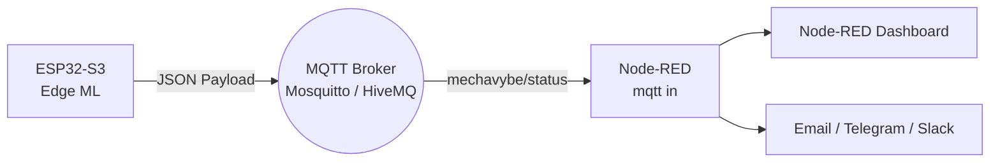

# MechaVybe: Node-RED & MQTT Integration Guide

This guide explains how to connect your MechaVybe ESP32 vibration sensor to [Node-RED](https://nodered.org/) using MQTT. Because the ESP32 runs TinyML on the edge, it acts as a smart sensor—only waking up the network to broadcast high-value alerts when it detects an anomaly, making it perfect for Node-RED automation.

---

## 1. Understanding the Data Flow

When the ESP32 detects an anomaly (Reconstruction Error > Threshold), it connects to the MQTT broker and publishes a JSON payload. It strictly rate-limits these alerts to a maximum of **1 per 10 seconds** to prevent broker spam.

* **Default Topic:** `mechavybe/status`
* **Payload Format:** `{"id": "node-1", "status": "anomaly", "score": 1.254}`



---

## 2. Setting Up the Node-RED Flow

To build a dashboard and alerting system, you will need the standard Node-RED nodes, plus the **`node-red-dashboard`** palette if you want visual widgets.

### Step 2.1: The MQTT Receiver
1. Drag an **`mqtt in`** node onto the canvas.
2. Double-click it and add your MQTT broker details (Server IP, Port `1883`).
3. Set the **Topic** to `mechavybe/status`.
4. Set the **Output** to `a parsed JSON object`.

### Step 2.2: Routing the Data
Drag a **`switch`** node onto the canvas and connect it to the `mqtt in` node. Configure it to route messages based on the status:
* **Property:** `msg.payload.status`
* **Rule 1:** `==` `anomaly`

*Note: The ESP32 currently only publishes anomalies, so this switch acts as a safety filter in case other devices publish to this topic.*

### Step 2.3: Extracting the Anomaly Score
Drag a **`change`** node and connect it to the output of the switch node. 
* Set **Rules** to: `Set` `msg.payload` `to` `msg.payload.score`
This strips out the JSON structure and passes only the numeric score (e.g., `1.254`) to your dashboard widgets.

### Step 2.4: Dashboard Visualization
Install the `node-red-dashboard` palette via the Palette Manager if you haven't already.
1. Drag a **`ui_gauge`** node and connect it to the `change` node.
2. Configure it:
   * **Label:** "Anomaly Score"
   * **Min:** `0`, **Max:** `3` (adjust based on your model's typical anomaly scores)
   * **Color gradient:** Green to Red
3. Drag a **`ui_toast`** (Notification) node and connect it to the `switch` node (bypassing the change node).
   * **Message:** `"Machine Vibration Anomaly Detected!"`

---

## 3. Quick Import: Copy-Paste Flow

If you want to instantly import this setup, copy the JSON block below, go to your Node-RED menu (top right) ➔ **Import**, and paste it in.

```json
[
    {
        "id": "mqtt_in_mechavybe",
        "type": "mqtt in",
        "z": "your_flow_id",
        "name": "MechaVybe MQTT",
        "topic": "mechavybe/status",
        "qos": "0",
        "datatype": "json",
        "broker": "your_broker_id",
        "x": 170,
        "y": 140,
        "wires": [
            [
                "switch_anomaly"
            ]
        ]
    },
    {
        "id": "switch_anomaly",
        "type": "switch",
        "z": "your_flow_id",
        "name": "Is Anomaly?",
        "property": "payload.status",
        "propertyType": "msg",
        "rules": [
            {
                "t": "eq",
                "v": "anomaly",
                "vt": "str"
            }
        ],
        "checkall": "true",
        "repair": false,
        "outputs": 1,
        "x": 370,
        "y": 140,
        "wires": [
            [
                "extract_score",
                "toast_alert"
            ]
        ]
    },
    {
        "id": "extract_score",
        "type": "change",
        "z": "your_flow_id",
        "name": "Extract Score",
        "rules": [
            {
                "t": "set",
                "p": "payload",
                "pt": "msg",
                "to": "payload.score",
                "tot": "msg"
            }
        ],
        "action": "",
        "property": "",
        "from": "",
        "to": "",
        "reg": false,
        "x": 570,
        "y": 100,
        "wires": [
            [
                "gauge_score"
            ]
        ]
    }
]
```
*(Note: You will need to double-click the MQTT node to select your specific broker configuration after importing).*

---

## 4. Advanced Automation Ideas

Since the ESP32 acts as a smart trigger, you can use Node-RED to build powerful industrial workflows:

* **Telegram Alerts:** Use the `node-red-contrib-telegrambot` node to instantly text maintenance staff when an anomaly triggers.
* **Auto-Shutdown:** If your machine is controlled by a PLC, use a Node-RED Modbus/OPC-UA node to safely halt the equipment if the anomaly score exceeds a critical threshold.
* **Database Logging:** Route the alerts into an InfluxDB node (`node-red-contrib-influxdb`) to keep a permanent history of when the machine started vibrating erratically, and visualize the timestamps in Grafana.
