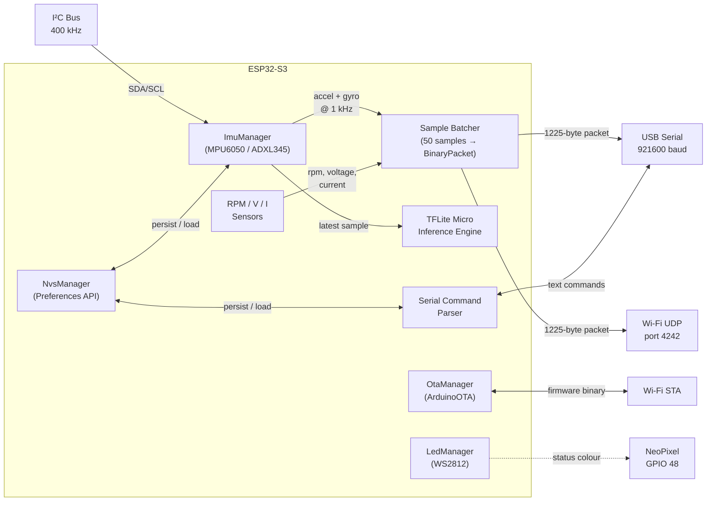
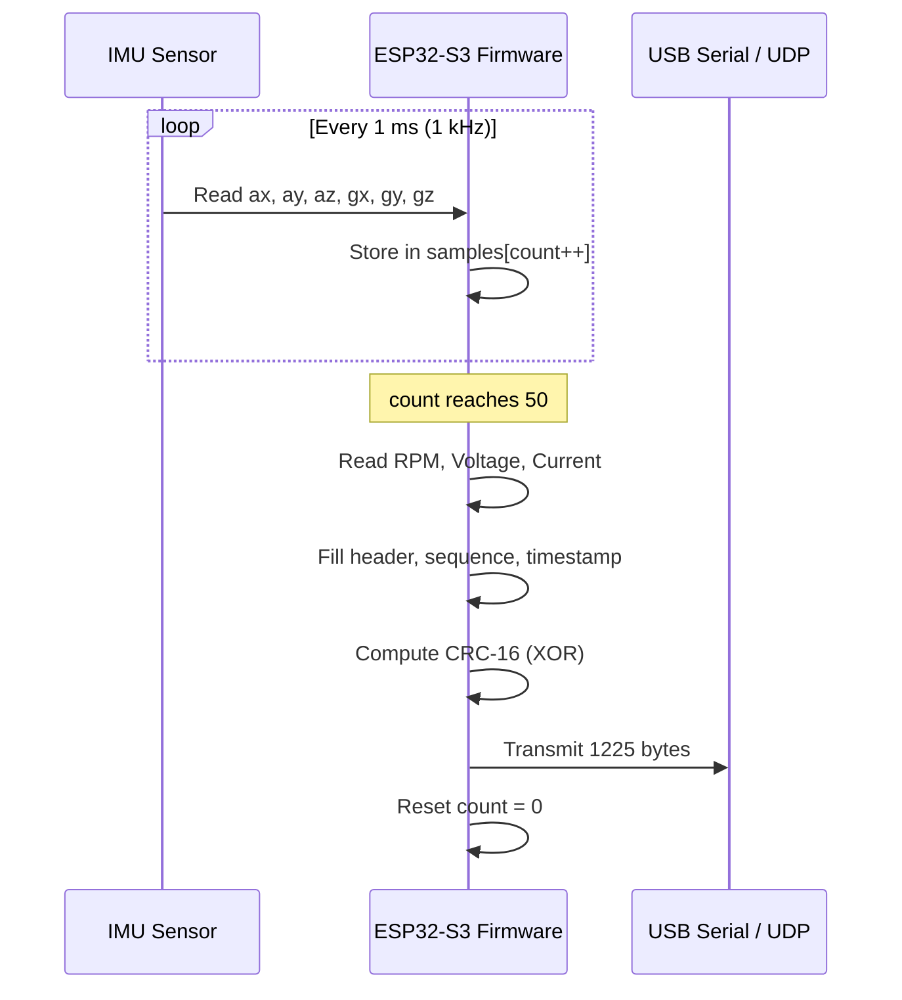
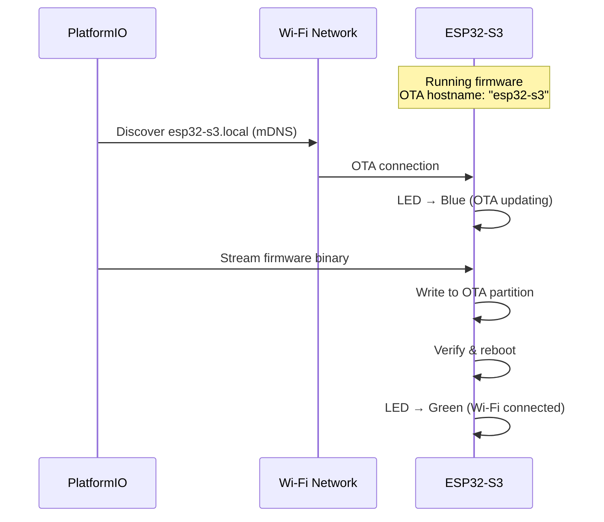
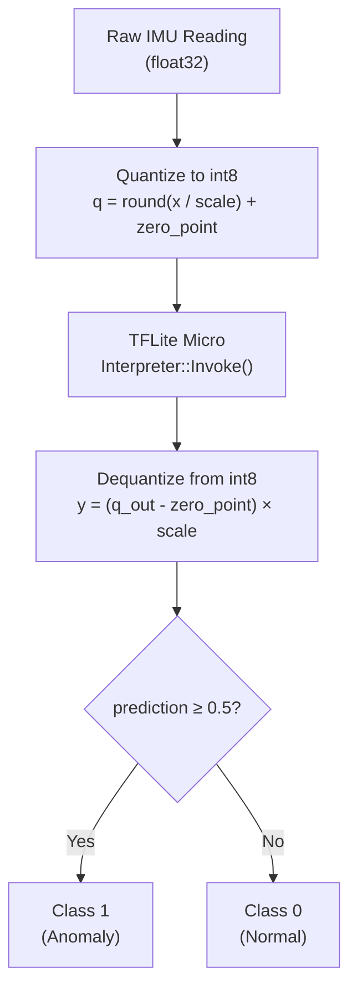

# MechaVybe — ESP32-S3 Firmware

High-speed MEMS vibration data-acquisition and on-device TinyML inference firmware for the ESP32-S3, built with PlatformIO and the Arduino framework.

---

## Table of Contents

1. [Module Overview](#1-module-overview)
2. [Hardware Requirements & Wiring](#2-hardware-requirements--wiring)
3. [Binary Packet Protocol](#3-binary-packet-protocol)
4. [Serial Command Reference](#4-serial-command-reference)
5. [NVS Configuration](#5-nvs-configuration)
6. [Build & Flash Instructions](#6-build--flash-instructions)
7. [Wi-Fi & OTA Setup](#7-wi-fi--ota-setup)
8. [TFLite Micro Integration](#8-tflite-micro-integration)
9. [Sampling Rate & I²C Timing Analysis](#9-sampling-rate--ic-timing-analysis)
10. [Glossary](#10-glossary)

---

## 1. Module Overview

This firmware turns an ESP32-S3 DevKitC-1 into a high-bandwidth vibration data logger and edge-inference device. It is designed for predictive maintenance on rotating machinery — motors, pumps, fans, compressors — where real-time accelerometer and gyroscope data must be captured, batched, and streamed to a host PC or processed on-device.

### Key Capabilities

| Feature | Detail |
|---|---|
| **IMU Sampling** | MPU6050 (6-axis) or ADXL345 (3-axis) at up to 1 kHz over I²C Fast Mode (400 kHz) |
| **Hardware Filtering** | MPU6050 on-chip DLPF at 184 Hz bandwidth |
| **Binary Streaming** | 50-sample packed binary packets over USB Serial (921 600 baud) or UDP (port 4242) |
| **On-Device Inference** | TensorFlow Lite Micro with int8 quantized models |
| **Persistent Config** | ESP-IDF NVS — device ID, sensor type, sample rate, ranges, calibration, Wi-Fi credentials |
| **OTA Updates** | ArduinoOTA over Wi-Fi |
| **Status LED** | WS2812 NeoPixel on GPIO 48 — colour-coded status |
| **Machine Monitoring** | Interrupt-driven RPM via hall-effect sensor, analog voltage & current sensing |

### Architecture



### Source Structure

```
firmware/
├── platformio.ini          # Build configuration
├── include/
│   ├── config.h            # Pin definitions, constants, defaults
│   ├── imu_manager.h       # IMU abstraction (MPU6050 / ADXL345)
│   ├── led_manager.h       # WS2812 NeoPixel LED driver
│   ├── logger.h            # Level-filtered serial logger
│   ├── nvs_manager.h       # Non-volatile storage wrapper
│   └── ota_manager.h       # Wi-Fi + ArduinoOTA manager
├── src/
│   ├── main.cpp            # Entry point, binary protocol, TFLite, serial commands
│   ├── model.h             # TFLite model as C byte array (g_model[])
│   ├── imu_manager.cpp     # IMU initialisation, calibration, read loop
│   ├── led_manager.cpp     # NeoPixel colour helpers
│   ├── logger.cpp          # printf-style serial logging
│   ├── nvs_manager.cpp     # Preferences-based key/value store
│   └── ota_manager.cpp     # Wi-Fi connection + OTA lifecycle
└── test/                   # Unit tests (PlatformIO Test Runner)
```

---

## 2. Hardware Requirements & Wiring

### Bill of Materials

| Component | Purpose | Notes |
|---|---|---|
| ESP32-S3-DevKitC-1 | MCU board | Must have PSRAM (N8R2 / N16R8 variant) |
| MPU6050 module | 6-axis IMU (accel + gyro) | Default sensor; I²C address `0x68` |
| ADXL345 module | 3-axis accelerometer | Alternative sensor; I²C address `0x53` |
| Hall-effect sensor | RPM measurement | Open-collector or digital output (optional) |
| Voltage divider | Voltage sensing | Scaled to 0–3.3 V range (optional) |
| ACS712 / INA219 | Current sensing | Analog output to ADC (optional) |
| USB-C cable | Programming + serial data | Native USB on ESP32-S3 |

### Pin Map

All default pins are defined in [`config.h`](include/config.h).

| GPIO | Function | Connected To | Config Constant |
|------|----------|--------------|-----------------|
| **8** | I²C SDA | MPU6050/ADXL345 SDA | `I2C_SDA_PIN` |
| **9** | I²C SCL | MPU6050/ADXL345 SCL | `I2C_SCL_PIN` |
| **10** | Interrupt | MPU6050 INT (data-ready) | `MPU_INT_PIN` |
| **48** | NeoPixel Data | WS2812 built-in LED | `WS2812_PIN` |
| *disabled* | Digital Input | Hall-effect signal | `RPM_PIN` |
| *disabled* | ADC Input | Voltage divider output | `VOLTAGE_PIN` |
| *disabled* | ADC Input | Current sensor output | `CURRENT_PIN` |

> **Note:** `RPM_PIN`, `VOLTAGE_PIN`, and `CURRENT_PIN` default to `-1` (disabled). Set them to valid GPIO numbers in `config.h` to enable machine-monitoring features.

### Wiring Diagram

```
                  ESP32-S3-DevKitC-1
                 ┌───────────────────┐
                 │                   │
    MPU6050      │   GPIO 8  (SDA) ──┤◄──── SDA
    / ADXL345    │   GPIO 9  (SCL) ──┤◄──── SCL
                 │   GPIO 10 (INT) ──┤◄──── INT (MPU6050 only)
                 │           3V3  ───┤────► VCC
                 │           GND  ───┤────► GND
                 │                   │
    Hall Sensor  │   GPIO xx (RPM) ──┤◄──── OUT  (configure RPM_PIN)
                 │           GND  ───┤────► GND
                 │                   │
    V-Divider    │   GPIO xx (ADC) ──┤◄──── VOUT (configure VOLTAGE_PIN)
    I-Sensor     │   GPIO xx (ADC) ──┤◄──── IOUT (configure CURRENT_PIN)
                 │                   │
    NeoPixel     │   GPIO 48 (DATA)──┤────► Built-in WS2812
                 │                   │
                 │       USB-C  ─────┤◄──► PC (Serial 921600 baud)
                 └───────────────────┘
```

### I²C Pull-ups

Most breakout modules include 4.7 kΩ pull-ups on SDA/SCL. If using bare chips, add **2.2 kΩ – 4.7 kΩ** pull-ups to 3.3 V. At 400 kHz Fast Mode, lower values (2.2 kΩ) are preferred for cleaner signal edges.

---

## 3. Binary Packet Protocol

Every 50 samples, the firmware assembles a tightly packed `BinaryPacket` and transmits it as a single byte stream. The struct uses `#pragma pack(push, 1)` to eliminate padding.

### Packet Layout

| Byte Offset | Length (B) | Type | Field | Description |
|:-----------:|:----------:|:----:|:------|:------------|
| 0 | 2 | `uint16_t` | `header` | Magic word `0xAABB` (transmitted as `0xBB 0xAA` in little-endian) |
| 2 | 4 | `uint32_t` | `sequence` | Monotonically increasing sample counter |
| 6 | 4 | `uint32_t` | `timestamp_us` | `micros()` at first sample in batch |
| 10 | 4 | `float` | `rpm` | Measured RPM (−1.0 if sensor disabled) |
| 14 | 4 | `float` | `voltage` | Measured voltage (−1.0 if sensor disabled) |
| 18 | 4 | `float` | `current` | Measured current (−1.0 if sensor disabled) |
| 22 | 1 | `uint8_t` | `sample_count` | Number of valid samples (always 50) |
| 23 | 1200 | `SensorData[50]` | `samples` | 50 × 24-byte sensor readings |
| 1223 | 2 | `uint16_t` | `crc` | XOR-based CRC-16 over bytes 0–1222 |
| | **1225** | | **Total** | |

### SensorData Sub-struct (24 bytes each)

| Offset within `SensorData` | Length | Type | Field | Unit |
|:---------------------------:|:------:|:----:|:------|:-----|
| 0 | 4 | `float` | `ax` | m/s² |
| 4 | 4 | `float` | `ay` | m/s² |
| 8 | 4 | `float` | `az` | m/s² |
| 12 | 4 | `float` | `gx` | rad/s |
| 16 | 4 | `float` | `gy` | rad/s |
| 20 | 4 | `float` | `gz` | rad/s |

> **Note:** When using the ADXL345 (accelerometer-only), gyroscope fields `gx`, `gy`, `gz` are zero-filled.

### Total Packet Size Derivation

$$
\underbrace{2}_{\text{header}} + \underbrace{4}_{\text{seq}} + \underbrace{4}_{\text{ts}} + \underbrace{4 \times 3}_{\text{rpm, V, I}} + \underbrace{1}_{\text{count}} + \underbrace{50 \times 24}_{\text{samples}} + \underbrace{2}_{\text{CRC}} = 1225 \text{ bytes}
$$

### CRC Calculation

The CRC is a simple XOR-fold over all preceding bytes in the packet:

```cpp
uint16_t crc = 0;
uint8_t* ptr = (uint8_t*)&tx_packet;
for (size_t i = 0; i < sizeof(BinaryPacket) - 2; i++) {
    crc ^= ptr[i];
}
tx_packet.crc = crc;
```

### Receiver-Side Parsing (Python Example)

```python
import struct

HEADER_MAGIC = 0xAABB
PACKET_SIZE  = 1225
SENSOR_FMT   = '<6f'          # ax, ay, az, gx, gy, gz
HEADER_FMT   = '<H I I f f f B'  # header, seq, ts, rpm, V, I, count

def parse_packet(data: bytes) -> dict:
    assert len(data) == PACKET_SIZE
    header, seq, ts, rpm, voltage, current, count = struct.unpack_from(HEADER_FMT, data, 0)
    assert header == HEADER_MAGIC

    samples = []
    for i in range(count):
        offset = 23 + i * 24
        ax, ay, az, gx, gy, gz = struct.unpack_from(SENSOR_FMT, data, offset)
        samples.append((ax, ay, az, gx, gy, gz))

    crc_recv = struct.unpack_from('<H', data, 1223)[0]
    crc_calc = 0
    for b in data[:1223]:
        crc_calc ^= b
    assert (crc_calc & 0xFFFF) == crc_recv, "CRC mismatch"

    return {"seq": seq, "timestamp_us": ts, "rpm": rpm,
            "voltage": voltage, "current": current, "samples": samples}
```

### Data Flow



---

## 4. Serial Command Reference

Commands are sent as newline-terminated ASCII strings over USB Serial at **921 600 baud**. The firmware responds with `[INFO]` log lines or structured `INFO:{...}` JSON.

| Command | Format | Description | Requires Reboot |
|---------|--------|-------------|:---------------:|
| **Set Wi-Fi** | `WIFI:<ssid>:<password>` | Store Wi-Fi credentials in NVS and reboot | ✅ |
| **Set Mode** | `MODE:<0\|1>` | `0` = data-logger mode, `1` = prediction/inference mode | ❌ |
| **Set Sample Rate** | `SET:RATE:<hz>` | Set sample rate (1–4000 Hz), persisted to NVS | ❌ |
| **Set Sensor** | `SET:SENSOR:<MPU6050\|ADXL345>` | Switch active IMU sensor, reboot required | ✅ |
| **Set Device ID** | `SET:ID:<string>` | Assign a human-readable device identifier | ❌ |
| **Set Accel Range** | `SET:ACCEL:<2\|4\|8\|16>` | Accelerometer full-scale range in ±g | ❌ |
| **Set Gyro Range** | `SET:GYRO:<250\|500\|1000\|2000>` | Gyroscope full-scale range in ±°/s | ❌ |
| **Set Accel Calibration** | `SET:CALIBA:<ox>,<oy>,<oz>,<sx>,<sy>,<sz>` | Manual accel offsets (o) and scale factors (s) | ❌ |
| **Auto-Calibrate** | `CMD:CALIBRATE` | Average 100 samples at rest, save offsets to NVS | ❌ |
| **Get Info** | `GET:INFO` | Returns JSON with device ID, firmware, sensor, heap, rates, calibration | ❌ |
| **Heartbeat** | `PING` | Keep-alive — resets PC-connected timeout (3 s) | ❌ |

### Example: GET:INFO Response

```json
INFO:{"id":"ESP32-IMU-01","fw":"1.0.0","sensor":"MPU6050","heap":245760,
      "rate":1000,"accel":8,"gyro":500,
      "calib_ax":0.12,"calib_ay":-0.03,"calib_az":0.45,
      "calib_gx":0.01,"calib_gy":-0.02,"calib_gz":0.00,
      "scale_ax":1.00,"scale_ay":1.00,"scale_az":1.00}
```

### LED Status Codes

| Colour | State | Meaning |
|--------|-------|---------|
| 🟡 Yellow (255, 128, 0) | Connecting | Wi-Fi connecting / boot |
| 🟢 Green (0, 255, 0) | Wi-Fi OK | Wi-Fi connected, no PC |
| 🔵 Cyan (0, 255, 255) | PC Connected | Serial heartbeat active (< 3 s since last PING) |
| 🔴 Red (255, 0, 0) | Error | Wi-Fi connection failed |
| 🔵 Blue (0, 0, 255) | OTA | Firmware update in progress |
| ⚫ Off (0, 0, 0) | Off | Initial state before `begin()` |

---

## 5. NVS Configuration

Configuration is persisted using the ESP-IDF Preferences API under the namespace **`esp32s3_app`**. Values survive power cycles and OTA updates.

| NVS Key | Type | Default | Description | Set Via |
|---------|------|---------|-------------|---------|
| `wifi_ssid` | String | `""` (falls back to `config.h`) | Wi-Fi SSID | `WIFI:` command |
| `wifi_pwd` | String | `""` (falls back to `config.h`) | Wi-Fi password | `WIFI:` command |
| `device_id` | String | `"ESP32-IMU-01"` | Human-readable device name | `SET:ID:` command |
| `sensor` | String | `"MPU6050"` | Active sensor type | `SET:SENSOR:` command |
| `sample_rate` | Int32 | `1000` | Sample rate in Hz (clamped 1–4000) | `SET:RATE:` command |
| `accel_range` | Int32 | `8` | Accelerometer range in ±g | `SET:ACCEL:` command |
| `gyro_range` | Int32 | `500` | Gyroscope range in ±°/s | `SET:GYRO:` command |
| `cal_ax` | Float | `0.0` | Accel X offset (m/s²) | `CMD:CALIBRATE` or `SET:CALIBA:` |
| `cal_ay` | Float | `0.0` | Accel Y offset (m/s²) | `CMD:CALIBRATE` or `SET:CALIBA:` |
| `cal_az` | Float | `0.0` | Accel Z offset (m/s²) | `CMD:CALIBRATE` or `SET:CALIBA:` |
| `cal_gx` | Float | `0.0` | Gyro X offset (rad/s) | `CMD:CALIBRATE` |
| `cal_gy` | Float | `0.0` | Gyro Y offset (rad/s) | `CMD:CALIBRATE` |
| `cal_gz` | Float | `0.0` | Gyro Z offset (rad/s) | `CMD:CALIBRATE` |
| `scl_ax` | Float | `1.0` | Accel X scale factor | `SET:CALIBA:` |
| `scl_ay` | Float | `1.0` | Accel Y scale factor | `SET:CALIBA:` |
| `scl_az` | Float | `1.0` | Accel Z scale factor | `SET:CALIBA:` |

### Calibration Model

Calibrated readings are computed as:

$$
a_{\text{calibrated}} = (a_{\text{raw}} - \text{offset}) \times \text{scale}
$$

For auto-calibration (`CMD:CALIBRATE`), the device averages 100 samples at rest and subtracts standard gravity (9.80665 m/s²) from the Z-axis:

$$
\text{offset}_z = \frac{1}{N}\sum_{i=1}^{N}(a_{z,i} - g)
$$

---

## 6. Build & Flash Instructions

### Prerequisites

| Tool | Minimum Version |
|------|----------------|
| [PlatformIO Core (CLI)](https://platformio.org/install/cli) | 6.x |
| [VS Code](https://code.visualstudio.com/) + PlatformIO IDE | Latest |
| Python | 3.8+ (for PlatformIO) |
| USB driver | ESP32-S3 native USB or CP210x/CH340 |

### Build

```bash
cd firmware

# Full build
pio run -e esp32-s3

# Clean build
pio run -e esp32-s3 --target clean
pio run -e esp32-s3
```

### Flash via USB

```bash
# Flash and monitor
pio run -e esp32-s3 --target upload && pio device monitor -b 921600
```

> **Tip:** If the ESP32-S3 is not entering download mode automatically, hold the **BOOT** button, press **RESET**, then release BOOT before running the upload command.

### Flash via OTA

Once Wi-Fi is configured and the device is on the network:

```bash
pio run -e esp32-s3 --target upload --upload-port esp32-s3.local
```

### Serial Monitor

```bash
pio device monitor -b 921600
```

### `platformio.ini` Summary

```ini
[env:esp32-s3]
platform    = espressif32
board       = esp32-s3-devkitc-1
framework   = arduino
upload_speed = 921600
monitor_speed = 115200

build_unflags = -std=gnu++11
build_flags =
    -std=gnu++14
    -DBOARD_HAS_PSRAM
    -DTF_LITE_STATIC_MEMORY
    -I.pio/libdeps/esp32-s3/esp-tflite-micro/third_party/flatbuffers/include
    -I.pio/libdeps/esp32-s3/esp-tflite-micro/third_party/gemmlowp
    -I.pio/libdeps/esp32-s3/esp-tflite-micro/third_party/ruy
    -I.pio/libdeps/esp32-s3/esp-tflite-micro/third_party/kissfft

lib_deps =
    https://github.com/espressif/esp-tflite-micro.git
    adafruit/Adafruit MPU6050 @ ^2.2.6
    adafruit/Adafruit Unified Sensor @ ^1.1.14
    adafruit/Adafruit NeoPixel @ ^1.12.0
    adafruit/Adafruit ADXL345 @ ^1.3.4
```

**Key build flags:**

| Flag | Purpose |
|------|---------|
| `-std=gnu++14` | Required by esp-tflite-micro (replaces default gnu++11) |
| `-DBOARD_HAS_PSRAM` | Enables PSRAM on N8R2/N16R8 variants |
| `-DTF_LITE_STATIC_MEMORY` | Uses static memory allocation for TFLite tensors |

---

## 7. Wi-Fi & OTA Setup

### Initial Wi-Fi Configuration

Wi-Fi credentials can be set in two ways:

**Option A — Compile-time defaults** in [`config.h`](include/config.h):
```cpp
constexpr char WIFI_SSID[]     = "YourSSID";
constexpr char WIFI_PASSWORD[] = "YourPassword";
```

**Option B — Runtime via serial command** (stored in NVS, overrides compile-time):
```
WIFI:YourSSID:YourPassword
```

The device will save the credentials and reboot. NVS credentials take priority over compile-time defaults.

### OTA Update Flow



### OTA Configuration

| Parameter | Value | Defined In |
|-----------|-------|------------|
| Hostname | `esp32-s3` | `Config::OTA_HOSTNAME` |
| Protocol | ArduinoOTA (ESP-IDF OTA partition) | `ota_manager.cpp` |
| Auth | None (default) | `ArduinoOTA` |

The `OtaManager::handle()` method must be called every `loop()` iteration to service OTA requests.

### UDP Streaming

When Wi-Fi is connected, the firmware listens on **UDP port 4242** for control messages:

| UDP Message | Response |
|-------------|----------|
| `START_STREAM` | Binary packets are sent via UDP to the sender's IP:port |
| `STOP_STREAM` | UDP streaming stops; falls back to USB Serial |

```python
import socket

sock = socket.socket(socket.AF_INET, socket.SOCK_DGRAM)
sock.sendto(b"START_STREAM", ("192.168.1.100", 4242))

while True:
    data, addr = sock.recvfrom(2048)
    packet = parse_packet(data)  # See Section 3
```

---

## 8. TFLite Micro Integration

The firmware embeds a quantized TensorFlow Lite model for on-device anomaly detection or classification. The model is compiled into the firmware as a C byte array in [`model.h`](src/model.h).

### Inference Pipeline



### Tensor Arena

The tensor arena is a contiguous memory block that holds all intermediate tensors during inference. It is allocated from **internal SRAM** (not PSRAM) for deterministic latency:

```cpp
tensor_arena = static_cast<uint8_t*>(
    heap_caps_malloc(
        Config::TENSOR_ARENA_SIZE,           // 32 KB
        MALLOC_CAP_INTERNAL | MALLOC_CAP_8BIT
    )
);
```

| Parameter | Value |
|-----------|-------|
| Arena size | 32 768 bytes (32 KB) |
| Memory type | Internal SRAM (`MALLOC_CAP_INTERNAL`) |
| Allocation | Dynamic at boot via `heap_caps_malloc` |

> **Warning:** If the tensor arena is too small, `AllocateTensors()` will fail. Increase `TENSOR_ARENA_SIZE` in `config.h` if you deploy a larger model. Monitor free heap via `GET:INFO`.

### Op Resolver

The firmware registers only the operators required by the deployed model, minimising flash usage:

```cpp
tflite::MicroMutableOpResolver<3> resolver;
resolver.AddFullyConnected();   // Dense layers
resolver.AddRelu();             // ReLU activation
resolver.AddLogistic();         // Sigmoid output
```

To add support for a different model architecture, register additional ops (e.g., `AddConv2D()`, `AddMaxPool2D()`, `AddReshape()`). The template parameter `<3>` must match the total number of registered operators.

### Quantization

The model uses **post-training int8 quantization**. Float inputs are converted to `int8` before inference and the `int8` output is converted back to float:

**Quantization (input):**

$$
q = \text{clamp}\!\left(\left\lfloor \frac{x}{\text{scale}} \right\rceil + \text{zero\_point},\; -128,\; 127\right)
$$

**Dequantization (output):**

$$
y = (q_{\text{out}} - \text{zero\_point}) \times \text{scale}
$$

where `scale` and `zero_point` are embedded in the TFLite model's tensor metadata and logged at boot.

### Inference Trigger

In **prediction mode** (`MODE:1`), inference runs every **100 ms** using the latest accelerometer X and Y values:

```cpp
float prediction = run_inference(imu.accelX, imu.accelY);
int predicted_class = prediction >= 0.5f ? 1 : 0;
```

### Model Replacement

1. Train your model in Python (TensorFlow/Keras)
2. Convert to TFLite with int8 quantization:
   ```python
   converter = tf.lite.TFLiteConverter.from_keras_model(model)
   converter.optimizations = [tf.lite.Optimize.DEFAULT]
   converter.representative_dataset = representative_data_gen
   converter.target_spec.supported_ops = [tf.lite.OpsSet.TFLITE_BUILTINS_INT8]
   converter.inference_input_type = tf.int8
   converter.inference_output_type = tf.int8
   tflite_model = converter.convert()
   ```
3. Convert to C array:
   ```bash
   xxd -i model.tflite > src/model.h
   ```
4. Rename the array to `g_model` and add `const` + `alignas(16)` qualifiers
5. Update `TENSOR_ARENA_SIZE` and op resolver if the architecture changed

---

## 9. Sampling Rate & I²C Timing Analysis

### I²C Bus Budget

At **400 kHz** (Fast Mode), each bit takes **2.5 µs**. Reading 14 bytes from the MPU6050 (6 × 16-bit sensor registers + overhead):

| Phase | Bytes | Bits (incl. ACK) | Time |
|-------|:-----:|:-----------------:|:----:|
| Start + address (write) | 1 | 9 | 22.5 µs |
| Register pointer | 1 | 9 | 22.5 µs |
| Repeated start + address (read) | 1 | 9 | 22.5 µs |
| Data bytes (14 registers) | 14 | 14 × 9 = 126 | 315 µs |
| Stop | — | 1 | 2.5 µs |
| **Total** | | | **≈ 385 µs** |

### Theoretical Maximum Sample Rate

$$
f_{\max} = \frac{1}{T_{\text{I2C}}} = \frac{1}{385\;\mu\text{s}} \approx 2\,597\;\text{Hz}
$$

With firmware overhead (calibration math, buffer management, etc.), practical maximum is approximately **1 000–2 000 Hz** for the MPU6050.

### ADXL345 Considerations

The ADXL345 has only 6 data registers (3 axes × 16 bits = 6 bytes), so I²C transfer is faster (~250 µs). However, its maximum I²C output data rate is **800 Hz** (3200 Hz and 1600 Hz are SPI-only).

### Bandwidth vs. Sample Rate

The MPU6050's **DLPF at 184 Hz bandwidth** acts as an anti-aliasing filter. According to the Nyquist theorem:

$$
f_{\text{sample}} \geq 2 \times f_{\text{bandwidth}} = 2 \times 184 = 368\;\text{Hz}
$$

Sampling at **1 000 Hz** with a 184 Hz DLPF provides an oversampling ratio of ≈ 2.7×, ensuring no aliasing and enabling potential noise reduction through decimation.

> **Important:** The DLPF setting `MPU6050_BAND_260_HZ` (which disables the DLPF) is **intentionally avoided** because some MPU6050 clone chips freeze and output static values when the DLPF is disabled. The 184 Hz bandwidth setting is the highest *safe* configuration.

### Throughput Analysis

At 1 kHz with a batch size of 50:

| Metric | Value |
|--------|-------|
| Packets per second | 1000 ÷ 50 = **20 packets/s** |
| Bytes per second | 20 × 1225 = **24 500 B/s** |
| USB Serial capacity (921 600 baud, 8N1) | ≈ 92 160 B/s |
| USB utilisation | 24 500 / 92 160 ≈ **26.6%** |
| Latency per batch | 50 × 1 ms = **50 ms** |

The USB Serial link has ample headroom. UDP over Wi-Fi (typical 5–15 Mbps throughput) also handles this data rate easily.

---

## 10. Glossary

| Term | Full Name | Definition |
|------|-----------|------------|
| **DLPF** | Digital Low-Pass Filter | On-chip configurable low-pass filter in the MPU6050 that attenuates high-frequency noise before the ADC output. Set via register 26 (CONFIG). The firmware uses the 184 Hz bandwidth setting, which limits the signal to frequencies below ~184 Hz and introduces ~2 ms group delay. |
| **I²C** | Inter-Integrated Circuit | A synchronous, multi-master, multi-slave serial bus using two wires (SDA for data, SCL for clock). The firmware uses **Fast Mode (400 kHz)**, which allows reading a full 6-axis IMU sample in under 400 µs. |
| **MEMS** | Micro-Electro-Mechanical Systems | Miniaturised mechanical structures fabricated on silicon chips. The MPU6050 and ADXL345 use MEMS capacitive sensing elements to measure acceleration (proof mass displacement) and angular velocity (Coriolis effect). |
| **NVS** | Non-Volatile Storage | An ESP-IDF key–value storage system built on top of SPI flash. Used via the Arduino `Preferences` library to persist configuration across power cycles without wearing a filesystem. Data is stored in a dedicated NVS flash partition. |
| **OTA** | Over-The-Air | A mechanism to update firmware wirelessly. The ESP32-S3 stores the new firmware in an alternate OTA partition, verifies it, and reboots into the updated image. Implemented via `ArduinoOTA` with mDNS discovery. |
| **CRC** | Cyclic Redundancy Check | An error-detection code appended to each binary packet. This firmware uses a simplified XOR-fold CRC-16: each byte is XOR'd into a running 16-bit accumulator. It detects single-bit errors and most burst errors but is not cryptographically secure. |
| **Binary Protocol** | — | A packed, non-text data encoding format for transmitting sensor data. Unlike CSV or JSON, binary protocols eliminate parsing overhead and minimise bandwidth. Each field is at a fixed byte offset, enabling `memcpy`-style zero-parse decoding on the receiver. |
| **Tensor Arena** | — | A pre-allocated, contiguous block of memory used by TFLite Micro to store all input, output, and intermediate tensors during inference. Unlike desktop TensorFlow, TFLite Micro cannot dynamically allocate memory — everything must fit within this fixed buffer. Allocated from internal SRAM for deterministic access latency. |
| **Quantization** | — | The process of converting a neural network's floating-point weights and activations to lower-precision integers (typically int8). This reduces model size by ~4×, speeds up inference on integer-only hardware, and lowers power consumption. The trade-off is a small accuracy loss, typically < 1% with representative calibration data. |

---

## License

See the root-level [LICENSE](../LICENSE) file for details.
