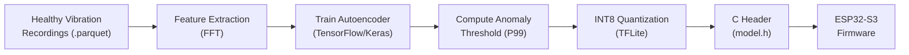
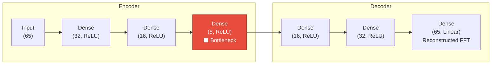
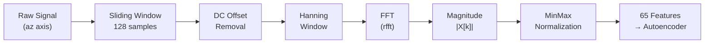
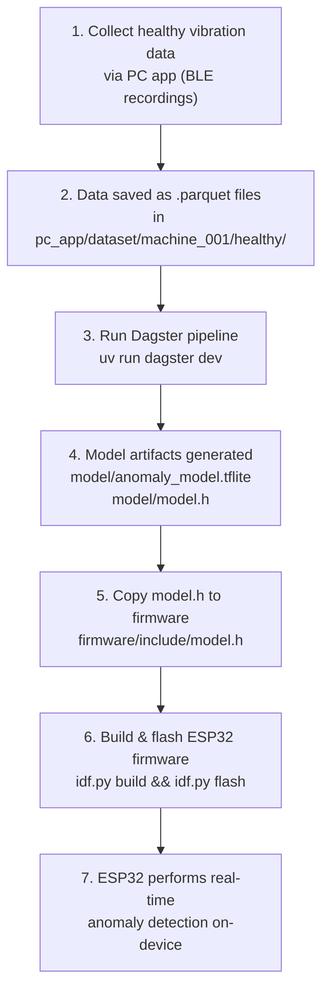

# Modeling — Vibration Anomaly Detection

Unsupervised machine-learning pipeline that trains an **Autoencoder** on healthy vibration data, exports a quantized **INT8 TFLite** model, and generates a **C header** for deployment on the ESP32-S3 microcontroller.

The core idea is simple: teach a neural network what *normal* vibrations look like.
When it encounters a vibration pattern it has never seen, it fails to reconstruct it — and that reconstruction error becomes the anomaly signal.

---

## Table of Contents

1. [Module Overview](#1-module-overview)
2. [Directory Structure](#2-directory-structure)
3. [Autoencoder Theory](#3-autoencoder-theory)
4. [Feature Extraction Pipeline](#4-feature-extraction-pipeline)
5. [Anomaly Threshold Calculation](#5-anomaly-threshold-calculation)
6. [INT8 Quantization for Microcontrollers](#6-int8-quantization-for-microcontrollers)
7. [C Header Generation](#7-c-header-generation)
8. [Synthetic Data Generation](#8-synthetic-data-generation)
9. [How to Use](#9-how-to-use)
10. [How to Evaluate the Model](#10-how-to-evaluate-the-model)
11. [Future Improvements](#11-future-improvements)

---

## 1. Module Overview

**MechaVybe** performs **predictive maintenance** by detecting mechanical faults (bearing wear, imbalance, misalignment) from accelerometer vibration signals — *before* catastrophic failure occurs.

The approach is **unsupervised**: only healthy/normal operating data is needed for training. No labeled fault data is required, which is critical because real-world fault data is rare and expensive to collect.



| Property              | Value                                  |
| --------------------- | -------------------------------------- |
| Learning paradigm     | Unsupervised (reconstruction-based)    |
| Model architecture    | Dense Autoencoder                      |
| Input features        | 65 FFT magnitude bins                  |
| Bottleneck dimension  | 8                                      |
| Training data         | Healthy vibration only                 |
| Anomaly criterion     | Reconstruction MSE > threshold         |
| Deployment target     | ESP32-S3 (INT8 TFLite, ~14 KB)        |

---

## 2. Directory Structure

```
modeling/
├── src/                  # Modular pipeline source code
│   ├── data.py           # Data loading and synthetic generation
│   ├── features.py       # FFT extraction and scaling
│   ├── model.py          # Keras Autoencoder definition
│   ├── export.py         # TFLite conversion and C-header generation
│   └── dagster_pipeline.py # Dagster orchestration and MLflow tracking
├── workspace.yaml        # Dagster workspace configuration
├── pyproject.toml        # Python dependencies (managed by uv)
├── eda.ipynb             # Exploratory data analysis notebook
├── notebooks/            # Additional analysis notebooks
└── model/                # Training output directory
    ├── anomaly_model.tflite   # Quantized INT8 model (13,976 bytes)
    └── model.h                # C header for ESP32 firmware
```

> [!NOTE]
> `test.py` currently contains test logic from an older 2-input classifier architecture and needs to be updated
> to work with the current 65-input autoencoder model.

---

## 3. Autoencoder Theory

### 3.1 What Is an Autoencoder?

An autoencoder is a neural network trained to reconstruct its own input. It consists of two mirrored halves:

- **Encoder** — compresses the input into a low-dimensional latent representation (the *bottleneck*).
- **Decoder** — reconstructs the original input from the compressed representation.

The key constraint is the **bottleneck**: by forcing data through a narrow layer, the network must learn a compressed representation that captures only the most important patterns in the data.

### 3.2 Architecture



| Layer         | Neurons | Activation | Role                                 |
| ------------- | ------: | ---------- | ------------------------------------ |
| Input         |      65 | —          | FFT magnitude bins (0–500 Hz)        |
| Dense 1       |      32 | ReLU       | First compression                    |
| Dense 2       |      16 | ReLU       | Further compression                  |
| **Bottleneck**|     **8**| **ReLU**  | **Compressed latent representation** |
| Dense 4       |      16 | ReLU       | Begin reconstruction                 |
| Dense 5       |      32 | ReLU       | Expand features                      |
| Output        |      65 | Linear     | Reconstructed FFT spectrum           |

**Compression ratio**: 65 → 8 = **8.125×** compression. The bottleneck forces the network to learn only the essential structure of healthy vibration spectra.

### 3.3 Training Objective

The autoencoder is trained to minimize the **Mean Squared Error (MSE)** between the input FFT vector **x** and the reconstructed output **x̂**:

$$
\mathcal{L}_{\text{MSE}} = \frac{1}{n} \sum_{i=1}^{n} (x_i - \hat{x}_i)^2
$$

Where:
- **x** = input FFT magnitude vector (65 bins)
- **x̂** = reconstructed FFT magnitude vector (65 bins)
- **n** = 65 (number of frequency bins)

### 3.4 Why This Works for Anomaly Detection

The critical intuition:

| Scenario | Input Pattern | Reconstruction Quality | MSE |
| -------- | ------------- | ---------------------- | --- |
| **Healthy** vibration | Seen during training | ✅ Excellent reconstruction | **Low** |
| **Anomalous** vibration | Never seen during training | ❌ Poor reconstruction | **High** |

Because the bottleneck has only 8 neurons, the network **cannot memorize** arbitrary inputs. It can only learn to compress and reconstruct patterns that are statistically similar to the training distribution (healthy vibrations). When a novel fault pattern arrives, the decoder cannot reconstruct it accurately, producing a large MSE — which we use as the anomaly score.

---

## 4. Feature Extraction Pipeline

Raw accelerometer time-series data is transformed into frequency-domain features before being fed to the autoencoder.



### 4.1 Signal Windowing

The continuous vibration signal is divided into overlapping windows:

| Parameter       | Value  | Description                                 |
| --------------- | ------ | ------------------------------------------- |
| Window size     | 128    | 128 samples per window                      |
| Sample rate     | 1000 Hz| Accelerometer sampling frequency            |
| Window duration | 128 ms | 128 / 1000 = 0.128 seconds per window       |
| Stride          | 64     | Step size between consecutive windows        |
| Overlap         | 50%    | (128 − 64) / 128 = 50% overlap              |

The 50% overlap ensures no transient events are missed at window boundaries.

### 4.2 DC Offset Removal

Remove the mean (DC component) so the FFT captures only the oscillatory content:

$$
x_{\text{centered}}[n] = x[n] - \frac{1}{N} \sum_{k=0}^{N-1} x[k]
$$

This eliminates any static offset from the accelerometer (e.g., gravity component on a non-level axis).

### 4.3 Hanning Window

A **Hanning** (Hann) window is applied to reduce spectral leakage caused by the finite-length windowing:

$$
w[n] = 0.5 \left(1 - \cos\left(\frac{2\pi n}{N - 1}\right)\right), \quad n = 0, 1, \ldots, N-1
$$

$$
x_{\text{win}}[n] = x_{\text{centered}}[n] \cdot w[n]
$$

The Hanning window tapers the signal smoothly to zero at both ends, preventing artificial high-frequency artifacts from abrupt truncation.

### 4.4 FFT Magnitude Spectrum

The **real-valued FFT** (`scipy.fft.rfft`) computes the frequency-domain representation:

$$
X[k] = \sum_{n=0}^{N-1} x_{\text{win}}[n] \cdot e^{-j2\pi kn / N}, \quad k = 0, 1, \ldots, \frac{N}{2}
$$

Only the magnitude is retained (phase is discarded):

$$
|X[k]| = \sqrt{\text{Re}(X[k])^2 + \text{Im}(X[k])^2}
$$

| Property            | Value                                |
| ------------------- | ------------------------------------ |
| FFT length          | 128 (= window size)                 |
| Output bins         | 65 (= N/2 + 1 = 128/2 + 1)         |
| Frequency resolution| Δf = Fs / N = 1000 / 128 ≈ 7.81 Hz |
| Frequency range     | 0 Hz to 500 Hz (= Fs / 2)           |

### 4.5 MinMax Normalization

Feature values are scaled to [0, 1] using the maximum observed across all training windows:

$$
x_{\text{scaled}}[k] = \frac{x[k]}{\max_{\text{training}}(x[k]) + \epsilon}
$$

Where ε = 10⁻⁶ prevents division by zero. The `feature_max` array (65 values) is saved and embedded in the C header so the ESP32 applies identical normalization at inference time.

---

## 5. Anomaly Threshold Calculation

After training, a threshold is computed that separates normal from anomalous reconstruction errors.

### 5.1 Procedure

```python
# 1. Run all healthy training data through the trained autoencoder
predictions = model.predict(X_train_scaled)

# 2. Compute per-sample reconstruction MSE
mse = np.mean(np.square(X_train_scaled - predictions), axis=1)

# 3. Set threshold at the 99th percentile
THRESHOLD = np.percentile(mse, 99)
```

### 5.2 Interpretation

$$
\text{THRESHOLD} = P_{99}(\text{MSE}_{\text{healthy}})
$$

- **99%** of healthy data will produce an MSE *below* this threshold → classified as **normal**.
- Only **1%** of healthy data will (by construction) exceed it → **false positive rate ≈ 1%**.
- Genuinely anomalous data should produce MSE values **significantly above** this threshold.

### 5.3 Sensitivity Tuning

The percentile is a tunable hyperparameter that controls the precision–recall tradeoff:

| Percentile | False Positive Rate | Sensitivity | Use Case                              |
| ---------- | ------------------- | ----------- | ------------------------------------- |
| 95th       | ~5%                 | 🔴 High     | Safety-critical: catch every fault, tolerate alarms |
| 99th *(default)* | ~1%          | 🟡 Balanced | General predictive maintenance        |
| 99.9th     | ~0.1%               | 🟢 Low      | Cost-sensitive: minimize false alarms, risk missing subtle faults |

> [!TIP]
> Start with the 99th percentile. If the system triggers too many false alarms during deployment,
> increase to 99.5th or 99.9th. If known faults go undetected, decrease toward 95th.

---

## 6. INT8 Quantization for Microcontrollers

### 6.1 Why Quantize?

The ESP32-S3 has **no hardware floating-point unit (FPU)** for neural network inference. Running a float32 model would require software floating-point emulation — orders of magnitude slower than native integer operations.

| Property        | Float32       | INT8            | Improvement |
| --------------- | ------------- | --------------- | ----------- |
| Precision       | 32 bits       | 8 bits          | —           |
| Model size      | ~56 KB (est.) | **13,976 bytes**| **~4×** smaller |
| Inference       | Software FP   | Integer ALU     | **~4–8×** faster |
| RAM usage       | Higher        | Lower           | Significant on 512 KB SRAM |

### 6.2 How It Works

**Post-training quantization** maps float32 weights and activations to int8 values using calibration data:

$$
q = \text{round}\left(\frac{x}{s}\right) + z
$$

Where:
- **x** = original float32 value
- **s** = scale factor (computed from the min/max range of activations)
- **z** = zero-point (integer offset so that float 0.0 maps to an exact integer)
- **q** = quantized int8 value ∈ [−128, 127]

The dequantization (inverse) is:

$$
x \approx s \cdot (q - z)
$$

### 6.3 Representative Dataset Calibration

The quantizer needs to observe the range of activations at every layer to compute optimal scale/zero-point values. A **representative dataset** (up to 500 training samples) is fed through the model during conversion:

```python
def representative_dataset():
    for i in range(min(500, len(X_train_scaled))):
        yield [X_train_scaled[i:i+1].astype(np.float32)]

converter = tf.lite.TFLiteConverter.from_keras_model(model)
converter.optimizations = [tf.lite.Optimize.DEFAULT]
converter.representative_dataset = representative_dataset
converter.target_spec.supported_ops = [tf.lite.OpsSet.TFLITE_BUILTINS_INT8]
converter.inference_input_type  = tf.int8
converter.inference_output_type = tf.int8
```

### 6.4 Accuracy Tradeoff

INT8 quantization introduces a small precision loss. However, for anomaly detection this is acceptable because:

1. The **decision boundary is coarse** — we compare MSE against a threshold, not making fine-grained predictions.
2. Anomalous inputs typically produce MSE values **10–100×** above the threshold, so small quantization errors don't affect the binary decision.
3. The threshold itself can be recalibrated post-quantization if needed.

---

## 7. C Header Generation
 
The final step of the Dagster pipeline (`exported_model` asset) generates a self-contained C header file that embeds everything the ESP32 firmware needs.
 
### 7.1 Contents of `model.h`
 
```c
// Auto-generated Anomaly Detection Model
// Input Shape: 65 (FFT Bins)
// Threshold: 0.001234
 
#ifndef MODEL_H
#define MODEL_H
 
#include <stdint.h>
 
// Quantized TFLite model weights
const unsigned int model_tflite_len = 13976;
const uint8_t model_tflite[] = {
    0x20, 0x00, 0x00, 0x00, 0x54, 0x46, 0x4c, 0x33, ...
};
 
// Per-bin normalization constants (from training data)
const float feature_max[65] = {
    12.3456, 8.7654, 5.4321, ...
};
 
// Anomaly decision threshold
const float ANOMALY_THRESHOLD = 0.001234;
 
#endif // MODEL_H
```
 
### 7.2 What Each Section Does
 
| Section             | Purpose                                                         |
| ------------------- | --------------------------------------------------------------- |
| `model_tflite[]`    | The INT8 quantized model weights as a byte array                |
| `model_tflite_len`  | Size in bytes (used by TFLite Micro to allocate the interpreter)|
| `feature_max[65]`   | Per-frequency-bin max values for MinMax normalization            |
| `ANOMALY_THRESHOLD` | MSE threshold — if reconstruction error exceeds this, flag anomaly |

### 7.3 Deployment

Copy the generated header to the firmware include directory:

```powershell
copy model\model.h ..\firmware\include\model.h
```

---

## 8. Synthetic Data Generation

When no real `.parquet` recordings are available, the `raw_signal` Dagster asset automatically generates synthetic vibration data using `src.data.generate_synthetic_data` for development and testing.

### 8.1 Healthy Signal

Simulates a normally operating machine with a 50 Hz fundamental frequency, a 120 Hz harmonic, and light Gaussian noise:

$$
x_{\text{healthy}}(t) = 0.5 \sin(2\pi \cdot 50 \cdot t) + 0.2 \sin(2\pi \cdot 120 \cdot t) + \mathcal{N}(0,\; 0.05)
$$

| Component                  | Frequency | Amplitude | Physical Interpretation        |
| -------------------------- | --------- | --------- | ------------------------------ |
| Motor fundamental          | 50 Hz     | 0.5       | Rotational speed (3000 RPM)    |
| 2nd harmonic               | 120 Hz    | 0.2       | Normal harmonic content         |
| Gaussian noise             | Broadband | σ = 0.05  | Normal operational vibration   |

### 8.2 Faulty Signal

Adds a 300 Hz bearing defect frequency and heavier broadband noise to simulate a developing fault:

$$
x_{\text{faulty}}(t) = x_{\text{healthy}}(t) + 0.4 \sin(2\pi \cdot 300 \cdot t) + \mathcal{N}(0,\; 0.15) - \mathcal{N}(0,\; 0.05)
$$

*(The net effect replaces σ = 0.05 noise with σ = 0.15 noise and adds the 300 Hz component.)*

| Component                  | Frequency | Amplitude | Physical Interpretation        |
| -------------------------- | --------- | --------- | ------------------------------ |
| All healthy components     | —         | —         | Base machine signature         |
| Bearing defect frequency   | 300 Hz    | 0.4       | Ball pass frequency (BPFO)     |
| Increased noise floor      | Broadband | σ = 0.15  | Mechanical looseness / wear    |

### 8.3 Generated Data Volumes

| Dataset      | Samples  | Duration @ 1 kHz | Windows (stride=64) |
| ------------ | -------- | ----------------- | -------------------- |
| Healthy      | 200,000  | 200 seconds       | ~3,124               |
| Faulty       | 50,000   | 50 seconds        | ~780                 |

---

## 9. How to Use

### 9.1 Prerequisites

- **Python ≥ 3.13** (managed by [uv](https://docs.astral.sh/uv/))
- Dependencies are declared in `pyproject.toml`:

| Package        | Version   | Purpose                          |
| -------------- | --------- | -------------------------------- |
| dagster        | ≥ 1.13.19 | Orchestration and Pipeline management |
| mlflow         | ≥ 3.15.2  | Experiment and metric tracking   |
| tensorflow     | ≥ 2.21.0  | Model training and TFLite export |
| numpy          | ≥ 2.5.2   | Numerical computation            |
| pandas         | ≥ 2.3.3   | Parquet data loading             |
| scipy          | ≥ 1.18.1  | FFT computation                  |
| scikit-learn   | ≥ 1.9.0   | Utility functions                |
| matplotlib     | ≥ 3.11.1  | Plotting and visualization       |

### 9.2 End-to-End Workflow



### 9.3 Step-by-Step Commands

**Step 1 — Collect data** (or use synthetic fallback):
```
# Record healthy vibration data using the PC app
# Files are saved to: pc_app/dataset/machine_001/healthy/*.parquet
```

**Step 2 — Train the model using Dagster and MLflow**:
```powershell
cd modeling

# Open the Dagster Orchestration UI
.\run_dagster.ps1
```
Visit `http://localhost:3000` to materialize the assets.

**Step 3 — Monitor training with MLflow**:
```powershell
# In a new terminal
cd modeling
uv run mlflow ui --backend-store-uri sqlite:///mlruns.db
```
Visit `http://localhost:5000` to track parameters, reconstruction loss, and anomaly thresholds across different runs.

**Step 4 — Deploy to firmware**:
```powershell
copy model\model.h ..\firmware\include\model.h
cd ..\firmware
idf.py build
idf.py flash
```

---

## 10. How to Evaluate the Model

### 10.1 Training Loss Curve

Monitor the training and validation loss across epochs:

| Observation                         | Interpretation                     | Action                               |
| ----------------------------------- | ---------------------------------- | ------------------------------------ |
| val_loss ≈ train_loss, both plateau | ✅ Good fit, no overfitting        | Proceed to deployment                |
| val_loss >> train_loss              | ⚠️ Overfitting                    | Reduce model capacity or add dropout |
| Loss still decreasing at epoch 30   | ⚠️ Underfitting                   | Increase epochs                      |
| Loss oscillates wildly              | ⚠️ Learning rate too high         | Reduce learning rate                 |

### 10.2 Reconstruction Error Distribution

Plot a histogram of the per-sample MSE on healthy training data. A well-trained model produces a **tight, narrow** distribution:

```python
import matplotlib.pyplot as plt
import numpy as np

# After training:
predictions = model.predict(X_train_scaled)
mse = np.mean(np.square(X_train_scaled - predictions), axis=1)

plt.figure(figsize=(10, 5))
plt.hist(mse, bins=100, alpha=0.7, label="Healthy MSE")
plt.axvline(THRESHOLD, color='r', linestyle='--', label=f"Threshold (P99) = {THRESHOLD:.6f}")
plt.xlabel("Reconstruction MSE")
plt.ylabel("Count")
plt.title("Healthy Data — Reconstruction Error Distribution")
plt.legend()
plt.show()
```

A good result shows:
- The bulk of the distribution is concentrated near zero.
- A clear separation between the 99th percentile line and where fault data MSE would appear.

### 10.3 Test with Known Fault Data

If faulty/anomalous data is available, verify that reconstruction MSE clearly exceeds the threshold:

```python
# Process faulty signal through the same pipeline
faulty_features = []
for i in range(0, len(test_faulty_signal) - WINDOW_SIZE, STRIDE):
    window = test_faulty_signal[i:i + WINDOW_SIZE]
    faulty_features.append(extract_fft_features(window))

X_faulty = np.array(faulty_features) / feature_max
faulty_predictions = model.predict(X_faulty)
faulty_mse = np.mean(np.square(X_faulty - faulty_predictions), axis=1)

detection_rate = np.mean(faulty_mse > THRESHOLD) * 100
print(f"Fault detection rate: {detection_rate:.1f}%")
```

### 10.4 Key Metrics

| Metric         | Definition                                        | Target       |
| -------------- | ------------------------------------------------- | ------------ |
| False Positive Rate | % of healthy data classified as anomalous    | < 1% *(by construction with P99)* |
| True Positive Rate  | % of faulty data correctly detected          | > 95%        |
| Precision      | TP / (TP + FP)                                     | High         |
| Recall         | TP / (TP + FN)                                     | High         |
| F1-Score       | 2 · (Precision · Recall) / (Precision + Recall)   | > 0.90       |

> [!IMPORTANT]
> Precision, Recall, and F1-Score can only be computed once labeled fault data is collected.
> Until then, rely on synthetic fault testing and the reconstruction error distribution shape.

---

## 11. Future Improvements

| Improvement | Description | Benefit |
| ----------- | ----------- | ------- |
| **Variational Autoencoder (VAE)** | Replace MSE-only loss with KL divergence + reconstruction loss. Produces a probabilistic anomaly score instead of a binary threshold. | Calibrated confidence levels, smoother latent space |
| **Convolutional Autoencoder** | Process raw time-domain windows with 1D convolution layers instead of FFT + Dense layers. Learns the optimal feature extraction end-to-end. | Potentially captures transient events that FFT averaging misses |
| **Online Learning** | Continuously update the threshold (and optionally fine-tune model weights) as the machine's baseline evolves over time. | Adapts to natural wear and seasonal drift without retraining |
| **Multi-axis Feature Fusion** | Concatenate FFT features from all three accelerometer axes (ax, ay, az) into a single 195-bin input vector. | Catches faults that manifest primarily on non-primary axes |
| **Attention Mechanisms** | Add self-attention layers to focus on the most diagnostically relevant frequency bins. | Improved sensitivity to narrow-band fault signatures |

---

## Quick Reference
 
```powershell
# Run orchestration UI (preserves history)
.\run_dagster.ps1
 
# Run tracking UI (in separate terminal)
uv run mlflow ui --backend-store-uri sqlite:///mlruns.db
 
# Deploy to firmware
copy model\model.h ..\firmware\include\model.h
```
