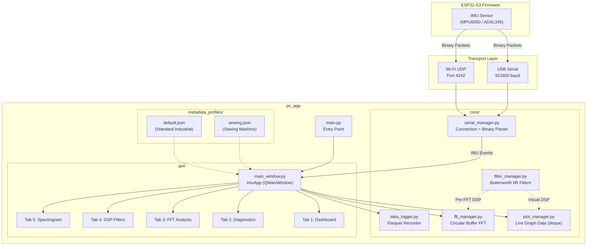

# MechaVybe — PC Data Acquisition Application

Real-time vibration data acquisition, visualization, and analysis desktop application built with **Python / PyQt6**. Connects to the ESP32-S3 firmware over **USB Serial** (921600 baud) or **Wi-Fi UDP** (port 4242) to stream, display, and record 6-axis IMU data for machine health monitoring and predictive maintenance.

> **Screenshot note:** The application window is a tabbed interface with five tabs — Dashboard, Diagnostics & Calibration, Frequency Analysis (FFT), Signal Processing (DSP), and Spectrogram — described in detail below.

---

## Table of Contents

1. [Quick Start](#quick-start)
2. [Architecture](#architecture)
3. [Tab-by-Tab Feature Guide](#tab-by-tab-feature-guide)
   - [Dashboard](#1-dashboard)
   - [Diagnostics & Calibration](#2-diagnostics--calibration)
   - [Frequency Analysis (FFT)](#3-frequency-analysis-fft)
   - [Signal Processing (DSP)](#4-signal-processing-dsp)
   - [Spectrogram](#5-spectrogram)
4. [Mathematical Background & Terminology](#mathematical-background--terminology)
   - [Discrete Fourier Transform (DFT / FFT)](#discrete-fourier-transform-dft--fft)
   - [Windowing & Spectral Leakage](#windowing--spectral-leakage)
   - [Power Spectral Density (Welch's Method)](#power-spectral-density-welchs-method)
   - [Butterworth IIR Filter](#butterworth-iir-filter)
   - [Notch Filter](#notch-filter)
   - [Time-Domain Vibration Metrics](#time-domain-vibration-metrics)
   - [Spectral Centroid](#spectral-centroid)
   - [Harmonic Analysis](#harmonic-analysis)
5. [How to Evaluate Each Metric](#how-to-evaluate-each-metric)
6. [Data Recording & Dataset Organization](#data-recording--dataset-organization)
7. [Binary Protocol Parsing](#binary-protocol-parsing)
8. [Performance Optimizations](#performance-optimizations)
9. [Configuration & Metadata Profiles](#configuration--metadata-profiles)

---

## Quick Start

### Prerequisites

- **Python ≥ 3.13**
- [**uv**](https://docs.astral.sh/uv/) package manager (recommended)

### Installation

```bash
cd pc_app

# Install all dependencies and create the virtual environment
uv sync
```

### Running

```bash
# Activate the environment and launch
uv run python main.py
```

### Dependencies

Defined in [`pyproject.toml`](pyproject.toml):

| Package       | Version    | Purpose                                   |
|---------------|------------|-------------------------------------------|
| `PyQt6`       | ≥ 6.11.0   | GUI framework                             |
| `pyqtgraph`   | ≥ 0.14.0   | High-performance real-time plotting       |
| `pyserial`    | ≥ 3.5      | USB Serial communication                  |
| `scipy`       | ≥ 1.18.1   | FFT, filters, signal processing           |
| `pandas`      | ≥ 3.0.5    | DataFrame construction for data logging   |
| `pyarrow`     | ≥ 25.0.1   | Apache Parquet file I/O                   |

---

## Architecture



### Module Responsibilities

| File | Class | Role |
|------|-------|------|
| [`main.py`](main.py) | — | Entry point. Creates `QApplication`, instantiates `ImuApp`, enters event loop. |
| [`gui/main_window.py`](gui/main_window.py) | `ImuApp` | Main window with 5 tabs. Orchestrates all managers. Runs a 10 ms UI timer, a 1 Hz ping timer, and a 10 Hz FFT timer. |
| [`core/serial_manager.py`](core/serial_manager.py) | `SerialManager` | USB Serial and UDP socket management. Binary packet parsing with CRC validation and timestamp interpolation. |
| [`core/plot_manager.py`](core/plot_manager.py) | `PlotManager` | Stores live graph data in `collections.deque(maxlen=500)`. Converts to NumPy arrays for `pyqtgraph` rendering. Optionally applies visual DSP filters without modifying raw data. |
| [`core/fft_manager.py`](core/fft_manager.py) | `FftManager` | Circular buffer (configurable 256–4096 points) for FFT computation. Computes magnitude spectrum, PSD, and all spectral/time-domain metrics. |
| [`core/filter_manager.py`](core/filter_manager.py) | `FilterManager` | Configurable Butterworth IIR filter chain. DC removal, detrending, notch filtering, and main band filter — all applied via `scipy.signal.filtfilt` for zero-phase filtering. |
| [`core/data_logger.py`](core/data_logger.py) | `DataLogger` | Records raw samples to a list, converts to `pandas.DataFrame`, saves as Apache Parquet with JSON metadata sidecar. |

---

## Tab-by-Tab Feature Guide

### 1. Dashboard

The Dashboard uses a **split layout** — a scrollable configuration sidebar on the left (2/7 width) and live graphs on the right (5/7 width).

#### Left Sidebar

| Section | Controls |
|---------|----------|
| **Connection & Logging** | Port dropdown, Refresh, Connect/Disconnect, Start/Stop Recording |
| **Data Acquisition Status** | Device ID, Sensor type, Connection status, Actual sampling rate, Received/Expected samples, Dropped/Duplicate counts, Stream integrity %, USB disconnect counter |
| **Data Acquisition Parameters** | Device ID (settable), Sensor selection (MPU6050 / ADXL345), Connection type (USB / Wi-Fi UDP), Sampling rate (10–4000 Hz), Accelerometer range (±2/4/8/16 g), Gyroscope range (±250/500/1000/2000 °/s), Channel count (6 or 3), Timestamp source (Device or Host), Recording duration (0 = infinite) |
| **Wi-Fi Configuration** | SSID & Password fields → sends `WIFI:ssid:pwd` command, stored to NVS on ESP32 |
| **Dataset & Recording Metadata** | Profile selector (loaded from `metadata_profiles/`), dynamic form generated from JSON schema |

#### Right Panel — Live Graphs

Two stacked `pyqtgraph` plots updated every 10 ms:

- **Accelerometer** (m/s²) — X (red), Y (green), Z (blue)
- **Gyroscope** (rad/s) — X (red), Y (green), Z (blue)

When DSP filters are enabled, the visual rendering applies the filter chain to the display data **without** modifying the underlying raw buffers or the recorded data.

---

### 2. Diagnostics & Calibration

| Feature | Description |
|---------|-------------|
| **Manual Calibration** | Per-axis offset (m/s²) and scale factor fields for X, Y, Z. Sends `SET:CALIBA:ox,oy,oz,sx,sy,sz` to the ESP32. |
| **Save / Load Profile** | Persists calibration values to `data/calibration_{device_id}.json` and reloads them by device ID. |
| **Auto-Calibration** | One-click `CMD:CALIBRATE` — the ESP32 computes zero-offset correction while the sensor is held level and still. |
| **Device Info** | `GET:INFO` fetches a JSON payload from the ESP32 containing device ID, sensor type, sampling rate, accel/gyro ranges, and current calibration values. Displayed in a read-only text area. |

---

### 3. Frequency Analysis (FFT)

#### Controls

| Control | Options |
|---------|---------|
| FFT Size | 256, 512, **1024** (default), 2048, 4096 |
| Window Function | **Hanning**, Hamming, Blackman, Rectangular |
| Axis | **Z**, X, Y |
| Mode | **Magnitude**, PSD (Power Spectral Density) |

#### Spectral Features Panel

| Metric | Description |
|--------|-------------|
| Frequency Resolution | Δf = f_s / N (Hz per bin) |
| Dominant Frequency | Frequency of the highest-amplitude bin (DC excluded) |
| Peak Amplitude | Magnitude at the dominant frequency |
| 2nd Harmonic | 2× the dominant frequency |
| 3rd Harmonic | 3× the dominant frequency |
| Spectral Centroid | Amplitude-weighted average frequency |
| Band Power | Total energy in the spectrum |

#### Time-Domain Features Panel (AC-Coupled)

| Metric | Description |
|--------|-------------|
| RMS Vibration | Root mean square of the AC-coupled signal |
| Peak Amplitude | Maximum absolute deviation |
| Peak-to-Peak | Full swing (max − min) |
| Crest Factor | Peak / RMS ratio |

The FFT plot and all metrics update at **10 Hz**, decoupled from the serial polling timer.

---

### 4. Signal Processing (DSP)

The DSP tab configures a **filter chain pipeline** that is applied as a visual overlay to the Dashboard graphs and as pre-processing to FFT computation. **Raw recorded data is never modified.**

#### Filter Chain Order

```
Input Signal
    │
    ▼
┌─────────────────────┐
│ 1. DC Removal        │  Subtract mean: y = x - x̄
│    (Mean Subtraction) │
└─────────┬───────────┘
          ▼
┌─────────────────────┐
│ 2. Linear Detrend    │  scipy.signal.detrend()
│    (Slope Removal)    │  Removes linear drift
└─────────┬───────────┘
          ▼
┌─────────────────────┐
│ 3. Notch Filter      │  IIR notch at 50 or 60 Hz
│    (Mains Rejection)  │  Q-factor = 30
└─────────┬───────────┘
          ▼
┌─────────────────────┐
│ 4. Butterworth Filter │  Type: LP / HP / BP / BS
│    (Main Filter)      │  Order: 1–10
│                       │  Cutoffs: 0.1–2000 Hz
└─────────┬───────────┘
          ▼
    Output Signal
```

#### Configuration Options

| Parameter | Range | Default |
|-----------|-------|---------|
| Enable DSP | On/Off | Off |
| Filter Type | None, Low-pass, High-pass, Band-pass, Band-stop | None |
| Butterworth Order | 1–10 | 4 |
| Low Cutoff | 0.1–2000 Hz | 10.0 Hz |
| High Cutoff | 0.1–2000 Hz | 500.0 Hz |
| DC Removal | On/Off | Off |
| Linear Detrend | On/Off | Off |
| Notch Filter | On/Off, 50 Hz or 60 Hz | Off, 50 Hz |

The tab also displays the **hardware anti-aliasing status**: the ESP32's internal DLPF (Digital Low Pass Filter) is set to 21 Hz by default, attenuating signals above this threshold before they reach the PC.

---

### 5. Spectrogram

A **rolling heatmap** of FFT magnitude history. Each column represents one FFT frame (computed at 10 Hz), and the image scrolls horizontally as new frames arrive.

| Property | Value |
|----------|-------|
| History depth | 150 time windows |
| Color map | Black → Blue → Cyan → Yellow → Red |
| Y-axis | Frequency (Hz), scaled by Δf |
| Auto-level | Intensity range auto-adjusts to max value |
| Implementation | `pyqtgraph.ImageItem` with `QTransform` scaling |

---

## Mathematical Background & Terminology

### Discrete Fourier Transform (DFT / FFT)

The Discrete Fourier Transform decomposes a time-domain signal **x[n]** of length **N** into its constituent frequency components:

$$X[k] = \sum_{n=0}^{N-1} x[n] \cdot e^{-j 2\pi k n / N}, \quad k = 0, 1, \ldots, N-1$$

where:
- **X[k]** is the complex-valued spectral coefficient at frequency bin **k**
- **j** is the imaginary unit (√-1)
- **N** is the FFT size (number of input samples)

The FFT is an O(N log N) algorithm for computing the DFT, compared to the naive O(N²).

**Key parameters:**

| Parameter | Formula | Example (f_s=1000, N=1024) |
|-----------|---------|---------------------------|
| Frequency resolution | Δf = f_s / N | 0.977 Hz |
| Nyquist frequency | f_Nyquist = f_s / 2 | 500 Hz |
| Maximum resolvable frequency | f_max = f_s / 2 | 500 Hz |
| Number of output bins | N/2 + 1 | 513 |

> **Nyquist–Shannon Theorem:** To faithfully represent a signal component at frequency **f**, the sampling rate must satisfy **f_s ≥ 2f**. Signals above **f_s / 2** will alias — folding back into the spectrum as phantom frequencies.

The amplitude spectrum is computed as:

$$|X[k]|_{\text{scaled}} = \frac{2}{N} \cdot |X[k]| \cdot C_{\text{window}}$$

where C_window is the amplitude correction factor for the applied window function.

---

### Windowing & Spectral Leakage

When the FFT operates on a finite block of samples, it implicitly assumes the signal is periodic with period N. If the signal's true period doesn't align with the FFT block, discontinuities at the boundaries cause **spectral leakage** — energy from a single frequency smears into neighboring bins.

**Window functions** taper the signal to zero at the edges, reducing this leakage at the cost of slightly worse frequency resolution.

| Window | Formula | Amplitude Correction (C) | Main Lobe Width | Side Lobe Level | Best For |
|--------|---------|--------------------------|-----------------|-----------------|----------|
| **Rectangular** | w[n] = 1 | 1.00 | Narrowest (2 bins) | −13 dB | Transient analysis, exact-period signals |
| **Hanning** | w[n] = 0.5(1 − cos(2πn/N)) | 2.00 | 4 bins | −31 dB | General-purpose vibration analysis |
| **Hamming** | w[n] = 0.54 − 0.46 cos(2πn/N) | 1.85 | 4 bins | −42 dB | When side-lobe suppression matters |
| **Blackman** | w[n] = 0.42 − 0.5 cos(2πn/N) + 0.08 cos(4πn/N) | 2.38 | 6 bins | −58 dB | Maximum side-lobe suppression |

The **amplitude correction factor** compensates for the energy lost due to tapering. Without it, windowed FFT amplitudes would be systematically underestimated. This application multiplies the raw FFT magnitudes by the correction factor to recover accurate peak amplitudes.

---

### Power Spectral Density (Welch's Method)

While the magnitude spectrum shows amplitude per frequency bin, the **Power Spectral Density (PSD)** estimates the signal's power distribution across frequency in units of **V²/Hz** (or equivalently g²/Hz for acceleration). This application uses **Welch's method** via `scipy.signal.welch`:

1. **Segment** the input into overlapping blocks
2. **Apply a window** to each segment
3. **Compute the FFT** of each windowed segment
4. **Square the magnitudes** to get the periodogram of each segment
5. **Average** all periodograms to reduce variance

$$P_{xx}(f) = \frac{1}{K} \sum_{i=1}^{K} \left| \frac{1}{N} \sum_{n=0}^{N-1} x_i[n] \, w[n] \, e^{-j2\pi fn/f_s} \right|^2$$

where **K** is the number of segments and **w[n]** is the window function. PSD is preferred for comparing signals of different lengths or sampling rates because it normalizes by frequency resolution.

---

### Butterworth IIR Filter

The application uses Butterworth infinite impulse response (IIR) filters, chosen for their **maximally flat magnitude response** in the passband — no ripple.

The squared magnitude response of an Nth-order Butterworth filter is:

$$|H(j\omega)|^2 = \frac{1}{1 + \left(\frac{\omega}{\omega_c}\right)^{2N}}$$

where:
- **ω_c** is the cutoff frequency (−3 dB point)
- **N** is the filter order (1–10 in this application)
- Higher order → steeper rolloff (20N dB/decade) but more phase distortion

| Filter Type | Description | Use Case |
|-------------|-------------|----------|
| **Low-pass** | Passes frequencies below cutoff | Remove high-frequency noise |
| **High-pass** | Passes frequencies above cutoff | Remove DC drift and low-frequency wander |
| **Band-pass** | Passes frequencies between two cutoffs | Isolate a specific frequency range |
| **Band-stop** | Rejects frequencies between two cutoffs | Remove a known interference band |

#### Zero-Phase Filtering (`filtfilt`)

Standard IIR filtering introduces **phase distortion** — different frequency components are delayed by different amounts. This application uses `scipy.signal.filtfilt`, which applies the filter in the **forward direction**, then applies it again in the **reverse direction**:

$$y[n] = h[n] * (h[-n] * x[n])$$

This yields:
- **Zero phase distortion** — signal features remain time-aligned
- **Doubled filter order** — a 4th-order filter applied via `filtfilt` gives 8th-order rolloff
- **Non-causal** — requires the entire signal block (suitable for offline / batch processing, not real-time sample-by-sample)

The padding length is computed as `min(3 × max(len(a), len(b)), len(y) − 1)` to avoid edge artifacts.

---

### Notch Filter

An IIR notch (band-reject) filter removes a single narrow frequency — used here to eliminate **mains power interference** at 50 Hz or 60 Hz.

Implemented via `scipy.signal.iirnotch(f_notch, Q, f_s)`:

| Parameter | Value | Meaning |
|-----------|-------|---------|
| f_notch | 50.0 or 60.0 Hz | Target frequency to reject |
| Q | 30.0 | Quality factor — higher Q = narrower notch |
| Bandwidth | f_notch / Q | ~1.67 Hz (for 50 Hz) or ~2.0 Hz (for 60 Hz) |

The notch filter is also applied via `filtfilt` for zero-phase operation.

---

### Time-Domain Vibration Metrics

All time-domain metrics are computed on the **AC-coupled** signal (mean-subtracted) to remove gravitational offset and reveal only the dynamic vibration component.

| Metric | Formula | Unit | Meaning |
|--------|---------|------|---------|
| **RMS** (Root Mean Square) | $\text{RMS} = \sqrt{\frac{1}{N} \sum_{i=1}^{N} x_i^2}$ | m/s² | Overall vibration severity. Proportional to signal energy. |
| **Peak** | $\text{Peak} = \max(\|x_i\|)$ | m/s² | Maximum instantaneous deviation. Sensitive to transients. |
| **Peak-to-Peak** (P2P) | $\text{P2P} = \max(x) - \min(x)$ | m/s² | Total excursion range. |
| **Crest Factor** | $\text{CF} = \frac{\text{Peak}}{\text{RMS}}$ | dimensionless | Ratio of peak to RMS. Measures signal "spikiness". |

---

### Spectral Centroid

The spectral centroid is the **amplitude-weighted average frequency** — the "center of mass" of the spectrum:

$$f_c = \frac{\sum_{k} f_k \cdot A(f_k)}{\sum_{k} A(f_k)}$$

where **f_k** is the frequency of bin **k** and **A(f_k)** is the amplitude (or PSD) at that bin. A shift in the spectral centroid indicates a redistribution of vibration energy across the spectrum.

---

### Harmonic Analysis

Once the **dominant frequency** (highest peak, excluding DC) is identified at frequency **f₁**, the application reports:

| Harmonic | Frequency | Typical Physical Source |
|----------|-----------|------------------------|
| 1× (Fundamental) | f₁ | Shaft rotation (imbalance) |
| 2× (2nd harmonic) | 2 × f₁ | Misalignment, looseness |
| 3× (3rd harmonic) | 3 × f₁ | Gear mesh, severe looseness |

---

## How to Evaluate Each Metric

### RMS Vibration — ISO 10816 Severity Chart

RMS velocity is the industry standard for vibration severity. While this application measures acceleration (m/s²), the relative magnitude can be compared against severity thresholds:

| Class | Zone A (Good) | Zone B (Acceptable) | Zone C (Alert) | Zone D (Danger) |
|-------|--------------|---------------------|----------------|-----------------|
| **Class I** — Small machines (≤15 kW) | ≤ 0.71 mm/s | 0.71–1.8 mm/s | 1.8–4.5 mm/s | > 4.5 mm/s |
| **Class II** — Medium machines (15–75 kW) | ≤ 1.12 mm/s | 1.12–2.8 mm/s | 2.8–7.1 mm/s | > 7.1 mm/s |
| **Class III** — Large machines (> 75 kW, rigid) | ≤ 1.8 mm/s | 1.8–4.5 mm/s | 4.5–11.2 mm/s | > 11.2 mm/s |
| **Class IV** — Large machines (flexible mount) | ≤ 2.8 mm/s | 2.8–7.1 mm/s | 7.1–18.0 mm/s | > 18.0 mm/s |

> **Note:** ISO 10816 uses RMS velocity (mm/s). To convert from acceleration, integrate the spectrum: v(f) = a(f) / (2πf). For raw acceleration RMS, establish your own baseline thresholds per machine.

### Crest Factor

| Crest Factor | Interpretation |
|-------------|----------------|
| ~1.4 | Pure sine wave (healthy rotating machinery) |
| 1.4–3.0 | Normal mixed vibration |
| 3.0–3.5 | Developing impulsive events — early warning |
| **> 3.5** | **Strong impulsive events — bearing damage, gear tooth cracks, impacts** |
| > 5.0 | Severe impacting; immediate investigation required |

A rising crest factor with stable RMS is a classic early indicator of **bearing spalling** — the RMS hasn't increased because the defect is small, but each impact creates a sharp spike.

### Dominant Frequency

| Pattern | Diagnosis |
|---------|-----------|
| **1× RPM** (f = RPM/60) | **Imbalance** — uneven mass distribution on the rotor |
| **2× RPM** | **Misalignment** — angular or parallel shaft offset |
| **Harmonics of RPM** (3×, 4×, …) | **Mechanical looseness** — structural looseness amplifies harmonics |
| **Non-synchronous** (not integer × RPM) | **Bearing defect** — BPFO, BPFI, BSF, FTF frequencies |
| **Very high frequency** (> 1 kHz) | **Gear mesh, electrical noise**, or resonance |

### Spectral Centroid Shift

| Trend | Interpretation |
|-------|----------------|
| **Upward shift** | Vibration energy migrating to higher frequencies — developing fault (bearing wear, gear damage) |
| **Downward shift** | Energy concentrating at lower frequencies — structural looseness, imbalance getting worse |
| **Stable** | Machine condition unchanged |

Track the spectral centroid over time. A sustained drift of > 10–15% from baseline warrants investigation.

### Band Power

Total spectral energy. Compare against baseline recordings to detect overall vibration increase. A 6 dB increase (4× power) from baseline is a common alert threshold in industrial monitoring.

---

## Data Recording & Dataset Organization

### Recording Flow

1. Click **Start Recording** — `DataLogger.start_recording()` begins buffering samples
2. Every incoming IMU event is appended as a row: `packet_id`, `timestamp`, `accel_x/y/z`, `gyro_x/y/z`, and optionally `rpm`, `voltage`, `current`
3. Timed recordings auto-stop via `duration_spin` (0 = infinite)
4. Click **Stop Recording** — metadata is gathered from the dynamic form, and the data is saved

### File Format

- **Data:** Apache Parquet (via `pyarrow`) — columnar, compressed, fast for analytical queries
- **Metadata:** JSON sidecar file alongside the Parquet file

### Directory Hierarchy

```
dataset/
├── machine_001/              # Machine ID
│   ├── healthy/              # Condition label
│   │   ├── run_20260827_143000/
│   │   │   ├── data.parquet
│   │   │   └── metadata.json
│   │   └── run_20260827_150000/
│   │       ├── data.parquet
│   │       └── metadata.json
│   └── bearing_fault/
│       └── run_20260827_160000/
│           ├── data.parquet
│           └── metadata.json
└── SEWING_01/
    └── needle_bent/
        └── run_20260828_090000/
            ├── data.parquet
            └── metadata.json
```

This structure is designed for **ML dataset organization** — each directory maps directly to class labels for supervised learning. The `condition` and `severity` fields serve as ground-truth labels.

### Metadata JSON Example

```json
{
    "machine_id": "machine_001",
    "condition": "healthy",
    "severity": "0 - Baseline (Healthy)",
    "session_id": "run_20260827_143000",
    "mounting_position": "motor_casing",
    "mounting_method": "magnetic",
    "load_percent": 100,
    "sensor_id": "ESP32-S3-01",
    "sampling_rate": "1000",
    "sensor_range": "Accel: 8, Gyro: 500"
}
```

### Parquet Schema

| Column | Type | Description |
|--------|------|-------------|
| `packet_id` | int | Monotonic sequence number from ESP32 |
| `timestamp` | float | Time in seconds (device or host clock) |
| `accel_x` | float | Accelerometer X (m/s²) |
| `accel_y` | float | Accelerometer Y (m/s²) |
| `accel_z` | float | Accelerometer Z (m/s²) |
| `gyro_x` | float | Gyroscope X (rad/s) |
| `gyro_y` | float | Gyroscope Y (rad/s) |
| `gyro_z` | float | Gyroscope Z (rad/s) |
| `rpm` | float | Motor RPM (optional, ≥ 0) |
| `voltage` | float | Supply voltage (optional, ≥ 0) |
| `current` | float | Motor current (optional, ≥ 0) |

---

## Binary Protocol Parsing

The ESP32-S3 firmware transmits IMU data as compact binary packets over USB Serial or UDP. The `SerialManager` class parses these packets in real time.

### Packet Structure

```
┌────────┬─────┬──────────┬──────┬─────────┬─────────┬───────┬───────────────────────┬───────┐
│ Header │ Seq │ Timestamp│ RPM  │ Voltage │ Current │ Count │ Samples (Count × 24B) │  CRC  │
│ 0xAABB │ u32 │  u32 µs  │ f32  │   f32   │   f32   │  u8   │  [ax,ay,az,gx,gy,gz]  │  u16  │
│  2B    │ 4B  │   4B     │  4B  │   4B    │   4B    │  1B   │  Count × 6 × f32      │  2B   │
└────────┴─────┴──────────┴──────┴─────────┴─────────┴───────┴───────────────────────┴───────┘
```

| Field | Offset | Size | Format | Description |
|-------|--------|------|--------|-------------|
| Header | 0 | 2 | `0xAABB` | Magic bytes — packet synchronization marker |
| Sequence | 2 | 4 | `<I` (uint32 LE) | Monotonically increasing packet counter |
| Timestamp | 6 | 4 | `<I` (uint32 LE) | ESP32 microsecond clock |
| RPM | 10 | 4 | `<f` (float32 LE) | Motor RPM (−1 if unavailable) |
| Voltage | 14 | 4 | `<f` (float32 LE) | Supply voltage (−1 if unavailable) |
| Current | 18 | 4 | `<f` (float32 LE) | Motor current (−1 if unavailable) |
| Count | 22 | 1 | `<B` (uint8) | Number of IMU samples in this packet |
| Samples | 23 | Count × 24 | `<6f` per sample | [ax, ay, az, gx, gy, gz] as float32 |
| CRC | 23 + Count×24 | 2 | `<H` (uint16 LE) | XOR checksum of all preceding bytes |

**Total packet length:** `23 + (Count × 24) + 2` bytes

### CRC Validation

The CRC is a simple **byte-wise XOR** of all bytes from offset 0 to the end of the samples section (exclusive of the CRC field itself):

```python
calc_crc = 0
for b in packet_bytes[:packet_len - 2]:
    calc_crc ^= b
```

Packets with mismatched CRC are silently discarded.

### Timestamp Interpolation

The firmware batches multiple samples per packet but provides only one timestamp per batch. To recover per-sample timestamps, the parser performs **causal interpolation**:

1. Track `last_batch_ts` and `last_batch_seq` across packets
2. Compute `seq_delta = current_seq - last_batch_seq`
3. Compute `batch_duration = current_ts - last_batch_ts`
4. Derive `sample_interval = batch_duration / seq_delta`
5. Assign each sample: `ts_i = batch_ts + i × sample_interval`

**Fallback:** If the batch duration is non-positive or exceeds 5 seconds (indicating a clock wrap or reset), the interval defaults to **500 µs** (2 kHz assumption). For the very first batch, a 1 kHz estimate is used (`count × 1000 µs`).

### Text Event Parsing

Non-binary data (no `0xAABB` header) is decoded as UTF-8 text lines. Lines prefixed with `INFO:` are parsed as JSON device information payloads. All other text is emitted as generic `TEXT` events.

### USB vs. UDP Differences

| Aspect | USB Serial | Wi-Fi UDP |
|--------|-----------|-----------|
| Buffering | Byte-stream with `bytearray` accumulation buffer | Datagram — each `recvfrom` returns a complete message |
| Sync Recovery | Drops one byte at a time if buffer exceeds 2048 bytes without finding `0xAABB` or `\n` | N/A — datagrams are self-contained |
| Connection Mgmt | `serial.Serial` open/close | UDP socket bind on `0.0.0.0:4242`, `START_STREAM` / `STOP_STREAM` commands |
| ESP32 Discovery | Direct COM port selection | Broadcast `START_STREAM` to `<broadcast>:4242`, cache first responder IP |

---

## Performance Optimizations

### 1. `collections.deque` vs. `list` for Live Data

The `PlotManager` uses `collections.deque(maxlen=500)` for all data channels instead of a plain Python list.

| Operation | `list` | `deque(maxlen=N)` |
|-----------|--------|-------------------|
| Append | O(1) amortized | **O(1)** |
| Evict oldest (when full) | O(N) — `list.pop(0)` shifts all elements | **O(1)** — circular buffer, pointer advance |
| Memory | Grows unbounded without manual management | **Fixed** — automatically evicts oldest |

At 1000+ Hz sampling, using `list.pop(0)` would shift up to 500 elements per sample — a severe bottleneck. The deque's circular buffer eliminates this entirely.

### 2. Broadcast IP Caching

The `SerialManager` caches the ESP32's IP address after the first UDP response:

```python
if not self.esp_ip and addr:
    self.esp_ip = addr[0]
```

All subsequent commands (`STOP_STREAM`, `PING`, `SET:*`) are sent directly to this cached IP instead of broadcasting. On Windows, **UDP broadcast can stall for 100–500 ms** per `sendto` call due to the OS iterating over all network interfaces. Caching the IP eliminates these stalls, keeping the command latency under 1 ms.

### 3. Decoupled Timer Architecture

| Timer | Interval | Purpose |
|-------|----------|---------|
| **Serial poll** | 10 ms | Drain the serial/UDP buffer as fast as possible |
| **FFT update** | 100 ms (10 Hz) | Recompute FFT, update spectrum + spectrogram |
| **Ping** | 1000 ms (1 Hz) | Keepalive to prevent ESP32 from timing out the stream |

Separating these timers prevents expensive FFT computation from blocking serial reads, and vice versa.

### 4. Circular Buffer FFT

`FftManager` uses a **fixed-size NumPy array** as a circular buffer (pointer wraps at `self.size`). When the buffer is full, the oldest sample is overwritten in-place — no memory allocation, no copying. The `compute_fft` method reconstructs the correct temporal order via `np.concatenate` only at computation time.

### 5. Visual-Only Filtering

`FilterManager.apply()` is called on **copies** of the data arrays during graph updates and FFT computation. The raw `deque` buffers in `PlotManager` and the `DataLogger` recording list are never modified, ensuring that:
- Recorded Parquet files always contain unfiltered raw data
- Filter settings can be changed at any time without data loss

---

## Configuration & Metadata Profiles

### Profile System

Metadata profiles define the recording metadata schema using JSON files in the [`metadata_profiles/`](metadata_profiles/) directory. The application dynamically generates a form in the Dashboard sidebar based on the selected profile.

### Profile JSON Schema

```json
{
    "name": "Display Name",
    "fields": [
        {
            "id": "field_key",
            "label": "Human-Readable Label",
            "type": "text | dropdown | number",
            "default": "default_value",
            "options": ["opt1", "opt2"],
            "min": 0,
            "max": 100,
            "suffix": " units"
        }
    ]
}
```

#### Field Types

| Type | Widget | Properties |
|------|--------|------------|
| `text` | `QLineEdit` | `default` (string) |
| `dropdown` | `QComboBox` | `options` (string array), `default` (string) |
| `number` | `QSpinBox` | `min`, `max`, `default` (int), `suffix` (string) |

### Included Profiles

#### Standard Industrial ([`default.json`](metadata_profiles/default.json))

Designed for general rotating machinery with fields for machine ID, fault condition (healthy / imbalance / misalignment / bearing_fault), severity level (0–4), mounting position, mounting method, and load percentage.

#### Sewing Machine ([`sewing.json`](metadata_profiles/sewing.json))

Specialized for garment industry equipment with fields for sewing-specific conditions (needle_bent / thread_tension / bobbin_issue), speed setting, fabric type, needle type, and thread material.

### Creating a Custom Profile

1. Create a new `.json` file in `metadata_profiles/`:

```json
{
    "name": "My Custom Machine",
    "fields": [
        {"id": "machine_id", "label": "Machine ID", "type": "text", "default": "PUMP_01"},
        {"id": "condition", "label": "Condition", "type": "dropdown", "options": ["healthy", "cavitation", "seal_leak"]},
        {"id": "session_id", "label": "Session ID", "type": "text", "default": ""},
        {"id": "pressure_psi", "label": "Pressure (PSI)", "type": "number", "min": 0, "max": 500, "default": 100, "suffix": " PSI"}
    ]
}
```

2. Click **Reload Profiles** in the Dashboard sidebar
3. Select your new profile from the dropdown

> **Important:** The `machine_id`, `condition`, and `session_id` fields have special significance — they determine the output directory hierarchy (`dataset/{machine_id}/{condition}/{session_id}/`). If `session_id` is left blank, it auto-generates as `run_{unix_timestamp}`.

---

## License

See the root project LICENSE file.
